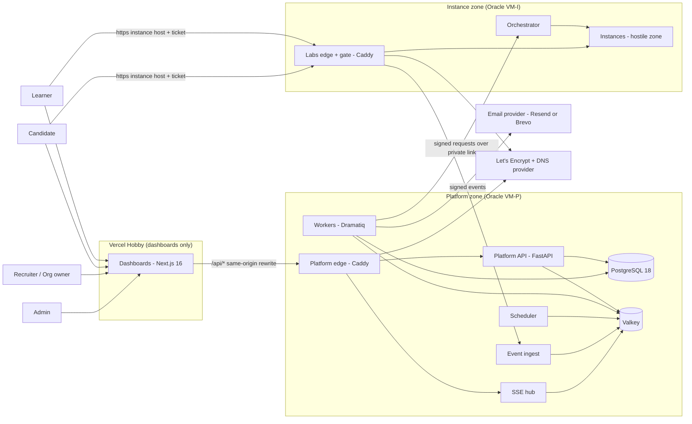

# 01. Overview and components

Status: PROPOSED architecture for the user's review (2026-10-08). Nothing here changes a locked decision (D-01 to D-27). Choices that no locked decision fixes are marked **Proposed** and have an ADR (0002 to 0015). External facts are cited as `[EF-n]` and listed with status and URL in the register in [README.md](README.md).

Plain-language terms used in this document (explained once):

- **Origin**: the exact web address a browser trusts as one unit (scheme + host + port). **Site**: the registrable domain (for example `example.com`); `a.example.com` and `b.example.com` are the same site, different origins.
- **Trust zone**: a group of parts that trust each other equally and are separated from other groups by a network wall.
- **Control plane**: the parts that run the product (accounts, scoring, dashboards). **Instance plane**: the parts that create and guard each user's private shop copy.
- **Edge proxy**: the single front door that receives all internet traffic and forwards it.
- **Sidecar**: a helper container placed in front of the shop that watches traffic and sends signed events.
- **Outbox**: a table that records "something must be sent" in the same database transaction as the change, so nothing is lost.

## 1. Context diagram

Reading guide: browsers never talk to the API host directly. They talk to the dashboard origin on Vercel, and `/api/*` is forwarded to the platform edge (ADR 0002). Browsers reach an instance only through the labs edge, on a different site from the platform (ADR 0003). An instance never initiates a connection to the platform. The only upward path is the sidecar's signed event call, relayed by the labs edge (ADR 0005).

## 2. Components

Technology comes from D-21 (platform) and D-24 (shop). Rows marked Proposed carry an ADR.

| ID | Component | Job | Technology | Owns this data | Zone |
|---|---|---|---|---|---|
| K-01 | **Dashboards** | Four role-based UIs (learner, candidate, recruiter, admin), consent screen, live monitor, SSE client with polling fallback | Next.js 16 (React 19.2), Node 24 LTS, hosted on Vercel Hobby. Proposed: TanStack Query, generated typed client, Tailwind with shadcn/ui (RS-D, UNVERIFIED) | Nothing persistent. Browser holds only the session cookie (set by the API) | Vercel |
| K-02 | **Platform edge proxy** | TLS for the platform host, accepts only requests carrying the Vercel origin secret, routes `/api/*` to API and `/api/live/*` to SSE hub, no response compression on streams | Caddy (Proposed, ADR 0003) | TLS keys and the origin secret | VM-P |
| K-03 | **Platform API** | All browser-facing business logic: accounts, sessions, MFA, organizations, assessments, invites, consent, attempts, hints, flag submission, reports, exports, admin, break-glass. Only writer of the platform database | FastAPI, Python 3.14, Pydantic v2, SQLAlchemy 2, Alembic, Argon2id | Platform database tables (section 4 of [04](04-data-and-state.md)) | VM-P |
| K-04 | **Workers** | Background jobs: provisioning calls, email sending (outbox relay), scoring of events, exports, deletion, notifications | Dramatiq on Valkey (compatibility with Valkey UNVERIFIED, spike S-18) | Nothing of its own (uses API code and DB) | VM-P |
| K-05 | **Scheduler** | Time-based jobs: retention sweeps, learner warning emails, invite purge, log purge, IP truncation, audit-chain verify and anchor, backup, expiry timers | Small leader-elected loop (database advisory lock) that enqueues Dramatiq jobs. Library choice at build time | `job_runs` table | VM-P |
| K-06 | **Event ingest** | Receives signed events from sidecars, verifies the signature, drops duplicates, writes them to a Valkey stream for scoring. No business logic, no cookies | Second entrypoint of the API codebase (FastAPI), tiny route set | None (queue only) | VM-P |
| K-07 | **SSE hub** | Holds long-lived browser streams, authorises each stream, replays missed events from Valkey Streams, sends heartbeats | Second entrypoint of the API codebase (async), separate container so long connections cannot starve the API | None (reads Valkey) | VM-P |
| K-08 | **PostgreSQL 18** | System of record. Two databases in one cluster: `vulnmart` (everything) and `vm_keystore` (encryption keys, excluded from rolling backups, see ADR 0008) | PostgreSQL 18 (supported to 2030-11-14, D-21) | All persistent data | VM-P |
| K-09 | **Valkey** | Dramatiq queues, rate-limit counters, SSE replay streams, session cache, idempotency keys | Valkey (BSD licence, D-21) with append-only persistence on | Transient only. Postgres is always the truth | VM-P |
| K-10 | **Email provider** | Delivers verification, reset, invite, approval and warning mail | Resend or Brevo (D-21, still OPEN as OI-32). Sending goes through the outbox | Provider holds delivery logs | External |
| K-11 | **Audit-log subsystem** | Append-only, hash-chained, pseudonymised log; chain verifier; daily head anchor outside the database | Module in the API plus restricted database roles and a scheduler job | `audit_log`, `audit_checkpoint`, `subject_map` | VM-P |
| K-12 | **Key service** | Wraps and unwraps per-assessment data keys, holds the key-encryption key reference, shreds keys | Module in the API using `cryptography` (AES-256-GCM) and the `vm_keystore` database | `vm_keystore.deks` | VM-P |
| K-13 | **Orchestrator** | Creates, resets, freezes, stops and destroys instances on one Docker host; runs the reconciler and reaper; reports state to the API; accepts instance IDs only | FastAPI plus Docker Engine Python SDK, behind a socket proxy (D-23, ADR 0010) | Docker objects and their labels (the fallback truth). No platform database access | VM-I |
| K-14 | **Labs edge and gate** | Terminates TLS for instance hosts, checks the access ticket and cookie, routes to the right sidecar, relays sidecar events to ingest, blocks frozen or closed instances | Caddy plus a small `gate` service (ADR 0003, 0004, 0005) | TLS keys, gate verification key | VM-I |
| K-15 | **Shop app** (inside each instance) | The vulnerable marketplace (six roles, about 20 tables, 7 state machines) | Node 24 LTS, Express, server-rendered pages (D-24) | Its own SQLite file. No contact with the platform database | Instance |
| K-16 | **Shop database** | Per-instance seeded SQLite file with flags patched in at start | SQLite (D-24) | Shop data (synthetic) | Instance |
| K-17 | **Read-only catalog store** | Separate product data for C03 SQL injection, no users, orders or flags | Proposed: a second SQLite file opened read-only by the shop (mode=ro on a read-only mount), not a container. The PRD wording is ambiguous, see PRD issue P-18 in [README.md](README.md) | Synthetic catalog | Instance |
| K-18 | **Isolated import service** | Runs the C06 import preview with lodash 4.17.11 in a fresh process per job, no network, no database | Node 24, vendored lodash (D-26) | None | Instance |
| K-19 | **Mock-services container** | One container with payment gateway, KYC provider, fake metadata service and the in-instance XSS collector (collector placement is Proposed, OI-18 is open) | Node 24 (D-26) | Mock ledgers, collector log | Instance |
| K-20 | **Coraza sidecar** | Reverse proxy in front of the shop: Coraza with OWASP CRS v4.30.0 in detect-only, response flag matcher, request metadata, signs and sends events, buffers during outage | Go (small program embedding Coraza, or Caddy plugin; decided by spike S-7) (D-23) | Event buffer (RAM and small disk) | Instance (dual-homed) |
| K-21 | **Bot (controller plus on-demand browser)** | A small always-present controller container receives "visit" requests from the shop; the headless browser process is launched only for a visit, with a fresh context, only the shop origin, a fixed lifetime, then closed (plays the support agent) | Headless Chromium with Playwright, non-root, no egress (D-18). Controller design is Proposed (IF-6 in [07](07-repo-and-workstreams.md)) | None | Instance |
| K-22 | **Flag injector** | One-shot step at instance start: reads flags from stdin, patches the SQLite snapshot and writes read-only files, then exits | Entrypoint of the shop image run as a one-shot container (Proposed, ADR 0009) | None (flags are never persisted) | Instance |
| K-23 | **CI/CD** | Lint, type, tests, contract checks, exploit verification, multi-arch image builds, layer scans | GitHub Actions on Linux runners (ADR 0011) | Build caches, image registry | GitHub |

### 2.1 Why two entrypoints of one API codebase (K-06, K-07)

The PRD says the platform database is owned only by the API (NFR-MNT-02). Ingest and the SSE hub are extra processes of the same code, so they obey that rule, share models and error handling, and can still be scaled and restarted on their own. They are separate containers because their traffic patterns differ: ingest is bursty and talks to the instance zone; the SSE hub holds thousands of idle connections.

### 2.2 Reconciling two PRD statements about instance state

FR-INS-07 says "only the orchestrator writes instance state". NFR-MNT-02 says the database is written only by the API. Resolution proposed: the orchestrator is the **authority** on instance state; it reports every transition to the API (signed internal call) and the API stores it. The API holds the **desired** state (which instances should exist, their expiry and access flag); the orchestrator holds the **actual** state (Docker labels). The reconciler compares the two (flow in [05](05-key-flows.md), section 9).

## 3. Component to requirement table

Requirement IDs are from [PRD.md](../prd/PRD.md). A component "implements" a requirement when it holds the main logic; supporting components are shown in brackets.

| Component | Functional requirements | Non-functional requirements |
|---|---|---|
| K-01 Dashboards | FR-DSH-01..06, FR-LIV-01, 04 (client side), FR-HNT-01..03 (UI), FR-PRV-01 (consent screen), FR-PRV-11, FR-EXP-01..03 (download UI), FR-ASM-01..04 (UI), FR-ADM-01..07 (UI), FR-NTF-04 | NFR-UX-01..04, NFR-SEC-03 (CSP, headers on web), NFR-SEC-06 |
| K-02 Platform edge | FR-LIV-02 (no buffering) | NFR-SEC-03 (HSTS, headers), NFR-SEC-06, NFR-CST-02 (Hobby limits, origin secret) |
| K-03 Platform API | FR-ACC-01..11, FR-ORG-01..08, FR-ASM-01..06, FR-SES-01..11 (state machine and clock), FR-HNT-01..03, FR-SCR-09, FR-DSH-01..06, FR-EXP-01..04, FR-PRV-01..04, 08, 09, FR-ADM-01..08, FR-FLG-05 (paste submit) | NFR-SEC-01, 02 (admin part), 03, 05, 08, NFR-EXT-01, NFR-OBS-01, 02, NFR-MNT-02, 05 |
| K-04 Workers | FR-ASM-06, FR-NTF-01, 02, FR-SCR-01..05, 10 (scoring jobs), FR-TIM-01..05 (computation), FR-ACH-01..04, 06, 07 (checks), FR-INS-01 (provision job), FR-SES-04 (expiry actions) | NFR-AVL-04, NFR-PRF-01 |
| K-05 Scheduler | FR-PRV-04..06, 14, 15, 18, FR-ACC-02/08 (token expiry), FR-SES-03, 04 (timers), FR-ASM-03 (invite expiry) | SM-8, NFR-AVL-05 (backup job) |
| K-06 Event ingest | FR-DET-04, FR-FLG-04 (platform side of capture), FR-FLG-09 | NFR-ISO-04, NFR-SEC-08 |
| K-07 SSE hub | FR-LIV-01..06, FR-DSH-03, FR-NTF-04 | NFR-PRF-03 |
| K-08 PostgreSQL | FR-PRV-10, 12 (storage), FR-ORG-06 (RLS second layer) | NFR-AVL-05, NFR-EXT-01, NFR-POR-01 |
| K-09 Valkey | FR-LIV-06, FR-ACC-10 (rate limits), FR-ASM-06 (queue), FR-ACH-01 (limits) | NFR-PRF-03, NFR-POR-01 |
| K-10 Email provider | FR-NTF-01..03, FR-ACC-02, 08 | NFR-CST-02 |
| K-11 Audit subsystem | FR-PRV-10, 11, FR-ADM-07, FR-EXP-04, FR-DSH-02 (view logging), FR-ADM-03 (break-glass log) | NFR-SEC-08 (append-only) |
| K-12 Key service | FR-PRV-12, FR-DET-03 (evidence encryption), FR-ASM-02 (token hash helper) | NFR-SEC-05 |
| K-13 Orchestrator | FR-INS-01, 03..09, FR-INS-11, FR-SES-04 (freeze/destroy), FR-SES-07, 09, FR-ADM-04, FR-FLG-03 (injection) | NFR-ISO-01..07, NFR-SEC-02 (L3), NFR-SEC-04, NFR-AVL-04, NFR-POR-01, NFR-EXT-02, 04, NFR-OBS-02 |
| K-14 Labs edge and gate | FR-INS-10, FR-SES-11, FR-SES-04 (freeze at the door), FR-INS-03 (activity signal) | NFR-SEC-06, NFR-ISO-02 (no host ports on instances) |
| K-15..K-19, K-22 Shop and parts | FR-SHP-01..15, FR-CHL-01..17, FR-INS-02, FR-FLG-03, FR-PRV-17 | NFR-EXT-03, NFR-ISO-03, 07 |
| K-20 Coraza sidecar | FR-DET-01..09, FR-FLG-04, 06, 07, FR-INS-02 | NFR-ISO-04, NFR-ISO-07 |
| K-21 Bot | FR-SHP-11, FR-DET-09 | NFR-ISO-07 |
| K-23 CI/CD | FR-CHL-16 | NFR-MNT-01..06, NFR-POR-02, 03, NFR-SEC-05, 07, NFR-CST-02 |

Requirements that no single component owns (cross-cutting, assigned to a stream in [07](07-repo-and-workstreams.md)): NFR-PRI-01, 02, NFR-AVL-01..03, NFR-CST-01, NFR-PRF-04..06, FR-PRV-16, 19, 20, FR-ACC-04.

## 4. Per-instance container set

| Container | Always on | Networks | Egress | Writable |
|---|---|---|---|---|
| shop | yes | instance | none | tmpfs for data and temp (candidate until OI-23 is decided) |
| import-service | yes (job process per request) | instance | none | tmpfs |
| mock-services (payment, KYC, metadata, collector) | yes | instance | none | tmpfs |
| sidecar | yes | instance and front | only to labs edge on the front network | small tmpfs buffer |
| bot controller | yes (idle, small); the Chromium process runs only during a visit | instance | none | tmpfs |
| injector | one-shot at start, removed at once | instance | none | tmpfs |

Always-on count is five containers per instance (shop, import service, mock services, sidecar, bot controller), plus a Chromium process only while a bot visit runs. The older estimate of about 400 MB per instance is not valid any more (PRD NFR-PRF-02); spike S-4 and S-5 replace it. See the capacity plan in [02](02-deployment-and-network.md), section 13.

## 5. Extensibility hooks (O6, NFR-EXT-01 to 04)

The architecture does not build API-security, mobile or SaaS features. It keeps these seams open so each can be added as data or a new module, not a redesign.

| Future item | Seam that exists now | What a later change adds |
|---|---|---|
| **OWASP API Security** challenges | The catalogue and the instance recipe are data (NFR-EXT-02). The shop exposes a JSON API next to its pages (NFR-EXT-03). The sidecar already classifies requests by CRS tags and the event schema has an open `type` and `labels` field | A new target template (`target_type = api-lab`), new catalogue rows, an API-aware rule set or classifier in the sidecar behind the same event schema. No orchestrator change |
| **OWASP Mobile** challenges | The instance contract lists `exposed_endpoints[]` (name, protocol, port, gate mode) instead of assuming one web port. The gate has a mode per endpoint | A mobile backend template, an APK download endpoint, a second public hostname for token-based clients. The `Authenticator` interface in the API (session cookie today) takes a token authenticator for the native app audience. This is the only place where JWT or OAuth (the options D-21 did not choose) would enter, scoped to a separate audience |
| **Hosted multi-tenant SaaS** | `org_id` on every recruiter-owned row, enforced in one place plus Row-Level Security (ADR 0014). `instance_hosts` is a table (kind, URL, capacity, optional dedicated `org_id`). Quotas are rows keyed by scope (user, org, global) | Per-org custom hostnames, per-org dedicated instance hosts, billing hook, SSO through an authentication library. Moving from the free VM to paid servers is configuration (NFR-POR-01) because the API reaches an instance host only through the orchestrator interface |
| **A second Docker host** (laptop, paid VM, cluster later) | The orchestrator contract is host-neutral. `instance_hosts` picks the host at provisioning time | A scheduler that chooses among hosts. Single-host assumptions are confined to the orchestrator and the labs edge |

Rule that protects these seams: the orchestrator accepts a **template ID** from a platform-side allowlist (mapped to pinned image digests), never an image name or a free-form spec. A new target type is added by extending that allowlist in the platform, not by loosening the orchestrator.
