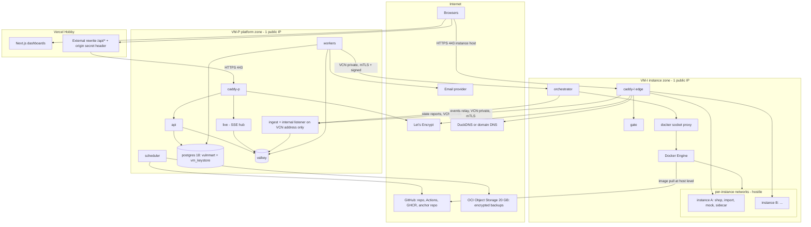
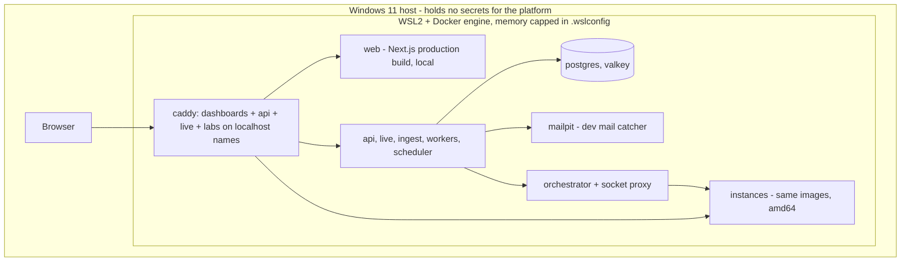
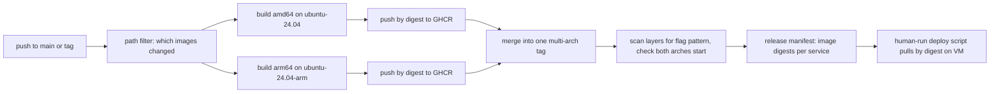
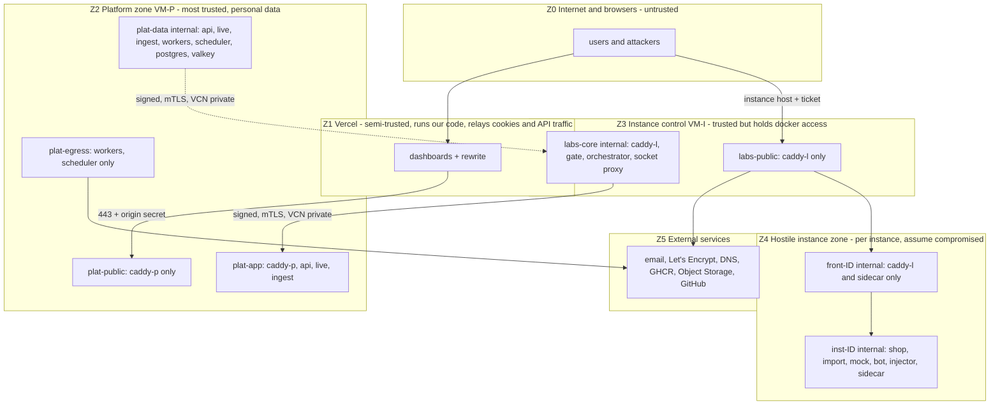

# 02. Deployment, network, CI/CD, operations and capacity

Status: PROPOSED (2026-10-08). External facts are cited `[EF-n]` (register in [README.md](README.md)). Decisions this document depends on: ADR 0002 (browser path), 0003 (addressing and TLS), 0005 (network and event path), 0007 (one VM or two), 0010 (orchestrator privileges and host rule), 0011 (multi-architecture CI), 0015 (laptop engine).

## 1. Environments at a glance

| Environment | Where | CPU architecture | Purpose | Locked by |
|---|---|---|---|---|
| **Production** | Dashboards on Vercel Hobby; platform and instances on Oracle Always Free Arm VM(s) | arm64 on Oracle, any on Vercel | Demo, pilot, hiring use | D-15 |
| **Laptop fallback** | Tanmay's PC (Ryzen 5, Windows 11), Docker with WSL2, whole stack on one machine | amd64 | Live demo if Oracle or the network fails; offline demo | D-15, NFR-AVL-02 |
| **Developer machines** | Tanmay (Windows 11), Akshay (Intel Mac), Sahil (Windows 11) | all amd64 | Daily work with Docker Compose | Q-24, NFR-POR-03 |
| **CI** | GitHub-hosted Linux runners, amd64 and arm64 | both | Tests, contract checks, image builds | D-14, NFR-MNT-04 |

No staging environment is defined by the PRD (see PRD issue P-21 in README). Proposal: Vercel preview deployments run against the mock API (Prism) only; there is one production stack.

## 2. Production deployment

The recommended shape is **two Oracle Arm VMs inside the same free allowance** (ADR 0007): VM-P for the platform (holds personal data) and VM-I for the instance plane (runs hostile code). Oracle's page states the free budget as 1,500 OCPU-hours and 9,000 GB-hours per month, equal to 2 OCPUs and 12 GB (VERIFIED, `[EF-21]`); the page text read this session does not state how many A1 instances may share it (RS-A says two, UNVERIFIED here). If the user prefers one VM, the same containers run on one host (ADR 0007, option A); only the addresses in the configuration change.



Notes on the diagram:

- Only `caddy-p` (VM-P) and `caddy-l` (VM-I) publish ports to the internet (80 for the certificate challenge and redirect, 443). SSH is key-only. Everything else has no published port or is bound to the VCN private address (Oracle's private network between the two VMs).
- Postgres, Valkey and the keystore never leave VM-P. The orchestrator and Docker socket never leave VM-I. A container escape on VM-I reaches the orchestrator and other instances, but not the platform database (the reason for ADR 0007, and the way to satisfy NFR-ISO-06, see PRD issue P-1).
- `ingest` has one extra listener bound to the VM-P private address. It accepts only signed sidecar events and signed orchestrator reports. It is not on the internet.
- Image pulls happen from the host daemon, not from containers (instances have no egress).

## 3. Laptop fallback (single machine, Docker with WSL2)



- Same images, same Compose files, different configuration (NFR-AVL-02, NFR-POR-01). The dashboards run locally behind the same Caddy, so `/api` is plain same-origin and Vercel is not needed.
- Hostnames are `localhost`-style names (`i-<id>.localhost`). Browsers treat loopback as a secure context for most features, but this is **plain HTTP on loopback**. D-16 says "never plain HTTP"; the architecture reads that as applying to public addresses only. **The user must confirm this reading** (listed in README).
- What cannot be proven here: the host-side drop rule (Docker Desktop's VM is not user-configurable, `[EF-19]`, RS-B), gVisor, arm64 behaviour, real certificates, Oracle security lists and the idle-reclaim rule. These are tested on the Oracle VM and in CI.
- The laptop engine choice (Docker Desktop versus an engine inside a dedicated WSL2 distro, where the drop rule can be installed) is ADR 0015. Docker's Windows page lists WSL 2 backend requirements without the Home edition yet also says Home runs Linux containers (CONFLICTING, `[EF-26]`); Tanmay's PC is Home (K-10) so this needs a real test.

## 4. Developer machines

| Developer | OS | Notes |
|---|---|---|
| Tanmay | Windows 11 Home, Ryzen 5 5600H, 15.3 GB, C: nearly full | Docker not running, WSL not set up (K-10). Move WSL and Docker data to D: and cap memory in `.wslconfig` (RS-A, verified keys) |
| Akshay | Intel Mac, 16 GB | Docker Desktop for Intel Macs is supported on the current and two previous macOS releases `[EF-26]` |
| Sahil | Windows 11 (edition not stated), Intel HP Victus, 16 GB | Confirm edition and that Docker runs (OI-6) |

All three machines are amd64. They run the full stack with `docker compose` (profile `dev`): Postgres, Valkey, Mailpit, API, workers, web, orchestrator, edge and the instance images. Instances on a developer machine use plain HTTP on `*.localhost` names. arm64 behaviour is tested only in CI arm64 jobs and on the Oracle VM. Scripts are Node.js (NFR-POR-03) so they run the same on Windows and macOS.

## 5. Per-environment configuration

Every item is a configuration value, never code (NFR-POR-01, NFR-EXT-04).

| Setting | Local dev | Laptop fallback | Production |
|---|---|---|---|
| `DASHBOARD_ORIGIN` | `http://localhost:3000` | `http://localhost` | Vercel project URL (a `*.vercel.app` name is its own site, `[EF-08]`) |
| `API_UPSTREAM` (the rewrite target) | `http://api:8000` (Next dev proxy) | Caddy route | `https://api.<PLATFORM_ZONE>` |
| `PLATFORM_ZONE`, `LABS_ZONE` | `localhost`, `localhost` | `localhost`, `localhost` | Per D-16 route, see [03](03-origins-and-access.md) |
| TLS mode | none (loopback) | none (loopback) | Let's Encrypt: wildcard via DNS-01 for `LABS_ZONE`, normal certificate for the API host |
| `ORIGIN_SECRET` check | off | off | on (Vercel adds it, `[EF-01]`) |
| `DB_URL`, `VALKEY_URL` | compose service names | compose service names | VM-P local addresses |
| `INSTANCE_HOST_URL` | `http://orchestrator:9000` | same | `https://<VM-I private address>:9443` with mTLS |
| Email | Mailpit | Mailpit | Resend or Brevo (OI-32) |
| Key source | `.env.dev` throwaway keys | generated at first start, kept in a file outside the repo | Files under `/opt/vulnmart/secrets` (mode 0400), ADR 0009 |
| Hardening level | baseline flags | baseline flags | baseline + host INPUT rule + rootless or user namespaces and gVisor only where the spike passes (NFR-ISO-05) |
| Image architecture | amd64 | amd64 | arm64 |
| Registry | local build | local build | GHCR (ADR 0011) |
| Timing knobs (idle, max lifetime, freeze, clock) | shortened for tests | PRD defaults | PRD defaults (60 min idle, 4 h max, 120 min assessment, 15 min freeze) |
| Backups | off | off | nightly encrypted dump to Object Storage, 14-day lifecycle (ADR 0008) |

## 6. CI/CD with GitHub Actions and multi-architecture builds

### 6.1 Workflows

| Workflow | Trigger (path filter) | What it does |
|---|---|---|
| `contracts` | `contracts/**` | Validates the OpenAPI fragments and JSON Schemas, bundles the API spec, runs breaking-change check (oasdiff, UNVERIFIED tool, RS-D), regenerates mocks and fails if committed output is stale |
| `api` | `apps/api/**`, `contracts/**` | ruff, type check, pytest with Postgres and Valkey services, `alembic heads` single-head check, migration from the previous release, OpenAPI export up to date. Nightly: Schemathesis (UNVERIFIED tool) against the running API |
| `web` | `apps/web/**`, `contracts/**` | Type check, unit tests, build; Playwright against the Prism mock nightly |
| `lab` | `apps/orchestrator/**`, `services/**`, `infra/**` | Unit tests, then **integration tests on the runner's Docker**: instance isolation tests (no route out, no route to other instances), the host INPUT rule test (Linux runners allow it, so the rule is tested here, not on Windows or macOS), reconciler tests |
| `shop` | `apps/shop/**`, `challenges/**` | Unit tests and the 11 exploit tests: pass on the vulnerable build, fail on the fixed build (FR-CHL-16); image-layer scan for the flag pattern (FR-FLG-03) |
| `images` | push to `main` or tag | Builds and publishes images (below) |
| `secrets-and-deps` | all pushes, weekly | gitleaks, dependency audit (C06's lodash is allow-listed as intentional, NFR-SEC-07) |

Pull requests never receive deployment secrets. There are no deployment credentials in CI at all: **deployment is a human-run script** (`scripts/deploy.mjs`) that SSHes to the VMs with the developer's own key (Q-32 decides who has keys), pulls images by digest and restarts services. Vercel deploys from the Git integration (private-repository support on Hobby for a personal account: UNVERIFIED, check at setup).

### 6.2 Building arm64 images for free

Facts (all VERIFIED unless noted):

- Standard Linux arm64 runners (`ubuntu-24.04-arm`) are available in **private** repositories since 2026-01-29, with 2 vCPU, and their usage draws from the plan's free minutes `[EF-15]`. The older 2025 post that said they fail in private repositories is out of date.
- In public repositories the same runners are free and unlimited, with 4 vCPU `[EF-15]`. This repository is private (D-14); making it public at submission would lift the minutes limit but D-14 says to do that only if examiners need it.
- GitHub Free gives 2,000 minutes per month on private repositories, 500 MB shared artifact and package storage, and a 10 GB cache per repository; the per-minute price table lists Linux 2-core x64 at USD 0.006 and Linux 2-core arm64 at USD 0.005 `[EF-16]`. The page does not state a minute multiplier for arm64, and whether free minutes are consumed one-for-one is UNVERIFIED.
- Docker documents two ways to build several platforms: QEMU emulation on one runner (which "can significantly extend build times") or one native runner per platform with a merge step `[EF-18]`.

Proposed pattern (ADR 0011): a **matrix of native builds** (`ubuntu-24.04` for amd64, `ubuntu-24.04-arm` for arm64), each pushing its image by digest, then a small job that merges the digests into one multi-architecture tag. Use build caching (the 10 GB cache) and path filters so only changed images rebuild. Cost: roughly each changed image consumes build time on two runners instead of one. The real minutes per full rebuild are unknown until measured (spike S-21); the PRD itself marks the 2,000-minute figure as unverified (NFR-MNT-04).



Registry: GHCR is described as currently free for storage and bandwidth, yet the same page lists a 500 MB / 1 GB per month quota for private packages on the Free plan (CONFLICTING inside one page, `[EF-17]`). Images carry challenge code, so private is preferred. Fallback options are in ADR 0011. The Caddy build needs a DNS plugin for the wildcard certificate, so it is built with a custom build step (UNVERIFIED, ADR 0003) on both architectures.

Each base image must have an arm64 variant (NFR-POR-02): Node, Caddy (custom), the Coraza sidecar (Go cross-compiles), Chromium for the bot (UNVERIFIED, check in spike S-5), Postgres, Valkey. CI fails if the arm64 job cannot start the image.

## 7. Network and trust zones



Rules the picture encodes:

1. Z4 has **one inbound door** (the labs edge on the front network) and **one outbound call** (the sidecar's signed event relayed by the same edge). There is no route to Z2, to the orchestrator, to Valkey or to another instance.
2. Each instance has two Docker networks, both marked internal (no route out): `inst-<id>` holds all containers; `front-<id>` holds only the sidecar and the labs edge. The shop cannot see `front-<id>`.
3. The labs edge is attached to every `front-<id>` and is the only container with several instance-zone legs. It is minimal, non-root, holds only its TLS keys and the gate key, and exposes only its public listener and an internal relay listener that is not published to the host (ADR 0005).
4. The platform is always the caller toward VM-I (orchestrator calls). VM-I calls Z2 only with signed reports and relayed events, to the internal listener on the VCN private address.

## 8. Allowed flows and everything denied

Anything not in this table is denied.

| ID | Source | Destination | Protocol and port | Purpose |
|---|---|---|---|---|
| F-01 | Browser | Vercel (dashboards and `/api/*`) | HTTPS 443 | Use the product (same origin) |
| F-02 | Vercel rewrite | `caddy-p` | HTTPS 443, header `x-origin-secret` | Proxy API and SSE (ADR 0002) |
| F-03 | `caddy-p` | `api`, `live` | HTTP on `plat-app` | Route requests |
| F-04 | `api`, `live`, `ingest`, `workers`, `scheduler` | Postgres | TCP 5432 on `plat-data` | Data access (separate database roles per service) |
| F-05 | same set | Valkey | TCP 6379 on `plat-data`, password | Queues, limits, streams |
| F-06 | `workers`, `scheduler` | Email provider, Object Storage, GitHub (anchor) | HTTPS 443, SSH 22 to GitHub | Mail, backups, audit anchor (only on `plat-egress`) |
| F-07 | `workers` | Orchestrator | HTTPS on VCN private address, mTLS plus HMAC-signed body | Provision, reset, freeze, destroy |
| F-08 | Orchestrator | `ingest` internal listener | HTTPS on VCN private address, mTLS plus signature | Instance state reports (API persists them) |
| F-09 | Browser | `caddy-l` (instance host) | HTTPS 443 | Use the shop (after ticket exchange) |
| F-10 | `caddy-l` | `gate` | HTTP on `labs-core` | Check ticket and cookie, access state |
| F-11 | `caddy-l` | Sidecar of the matching instance | HTTP 8080 on `front-<id>` | Forward player traffic |
| F-12 | Sidecar | `caddy-l` relay listener | HTTP 8081 on `front-<id>` | Send signed events upward |
| F-13 | `caddy-l` | `ingest` internal listener | HTTPS on VCN private address, mTLS | Relay events to the platform |
| F-14 | Sidecar | Shop | HTTP 3000 on `inst-<id>` | Proxy |
| F-15 | Shop | Mock-services, import service, sidecar event endpoint | HTTP on `inst-<id>` | Payment, KYC, metadata, import, app events |
| F-16 | Bot | Shop, collector | HTTP on `inst-<id>` | Simulated victim visit |
| F-17 | Orchestrator | Docker socket proxy | TCP on `labs-core` | Container and network control |
| F-18 | Orchestrator | `gate`, `caddy-l` state | HTTP on `labs-core` | Push access state (open, frozen, closed) and access epoch |
| F-19 | `caddy-p`, `caddy-l` | Let's Encrypt, DNS provider | HTTPS 443 egress | Certificates and DNS challenge |
| F-20 | Docker host (not containers) | GHCR | HTTPS 443 | Pull images by digest |
| F-21 | Developer | VM SSH | TCP 22, key-only | Deploy and maintain |

**Denied, stated explicitly:**

- Any container of an instance to: the internet, the local network, `169.254.169.254`, the host gateway IP or host services, `host.docker.internal`, another instance, `front-*` of other instances, any platform network, Valkey, Postgres, the orchestrator, the socket proxy, the gate.
- Shop, import service, mock-services and bot to the sidecar's signing key and to the front network (not attached).
- The sidecar to anything except the labs edge relay listener on its own front network.
- The internet to: Postgres, Valkey, ingest, orchestrator, socket proxy, gate, any instance container (no published ports on any of them).
- The internet to the API host without the origin secret (rejected at `caddy-p`).
- VM-P workers or API to any instance network (they reach instances only through the orchestrator).
- Vercel to anything except `caddy-p`.
- Instance containers to the Docker socket, host paths or host network (NFR-ISO-03).

## 9. The host-side drop rule (D-23, NFR-ISO-02)

**Why it is needed.** Docker's own page says that on an internal network "communication with the gateway IP address (and thus appropriately configured host services) is possible" and the host may reach any container IP `[EF-19]`. So an internal network alone does not stop an instance from talking to services listening on the host.

**A correction to the usual advice (needs a test).** RS-B and the PRD acceptance criterion name the `DOCKER-USER` chain. Docker's firewall page says its rules are in the **FORWARD** chain, which jumps to `DOCKER-USER`, and it says nothing about traffic from a container to the host itself `[EF-20]`. Packets from a container to a host-local address are not forwarded; they enter the host through the **INPUT** chain. The architecture therefore proposes the drop rule in INPUT (and keeps `DOCKER-USER` for defence in depth between networks). This reasoning is an inference, not a documented fact, so it is spike S-3: from inside an instance container, scan the gateway IP across all ports with and without the rule.

Illustrative rule shape (not to be run as written; the real rule set and persistence are decided in S-3):

```
# instance and front networks are carved from one reserved address pool (value to choose, set in the Docker daemon config)
allow established and related replies first
drop everything arriving from the instance address pool and destined for a host-local address
```

Other conditions: host services (sshd aside) listen only on loopback or the VCN private address; the orchestrator and socket proxy listen on `labs-core` or the private address, never `0.0.0.0` on a public interface; the rule is reapplied on boot and after a Docker restart (a systemd unit with a check, tested in S-3). CI proves the rule on a Linux runner. Docker Desktop cannot run it (hidden VM), so the laptop fallback is a lower-assurance mode: no secrets for the platform on that machine, not exposed publicly.

## 10. Startup order and recovery

### 10.1 Cold start

VM-P: (1) Docker; (2) `postgres`, `valkey`; (3) one-shot `migrate` (Alembic upgrade to head, single head enforced); (4) `api`, `ingest`, `live`; (5) `workers`, `scheduler`; (6) `caddy-p` last, so no traffic arrives early. Health gates: each service waits for its dependency's readiness endpoint.

VM-I: (1) Docker and the host INPUT rule (verified before anything else starts); (2) socket proxy; (3) `orchestrator` runs **reconcile before accepting calls**; (4) `gate`; (5) `caddy-l` and re-attachment to existing `front-*` networks; (6) instances (restored or failed by the reconciler).

### 10.2 What happens after a restart

| Event | Result |
|---|---|
| Orchestrator crash or restart | Reconciler lists Docker objects by label, compares with desired state fetched from the API, removes orphans, re-reports state; a half-created instance is retried once or twice (OI-24) then destroyed and marked failed. Flow in [05](05-key-flows.md) section 9 (spike S-13) |
| Caddy-l recreated | It loses its network attachments; the reconciler re-attaches it to every live `front-*` (spike S-15 checks restart versus recreate behaviour) |
| VM-I reboot | Instance containers do not restart by themselves. Learner instances are marked destroyed and the learner is told. A candidate instance in a running attempt is **re-provisioned with a new epoch** (new flags, same attempt, milestones kept, clock unchanged) and an `infrastructure_fault` event is recorded for the recruiter. This depends on OI-23 |
| VM-P reboot | Services restart in order; queued jobs survive in Valkey (append-only persistence); outbox rows and the domain-event table are replayed |
| Valkey data loss | Streams restart empty; clients receive a `resync` event and reload snapshots; Dramatiq loses only unacknowledged queue items, which the outbox and scheduler re-create (Postgres is the truth) |

## 11. Failure modes and recovery

| Failure | Effect | Detection | Recovery |
|---|---|---|---|
| Vercel outage or Hobby quota exhausted | Dashboards unavailable; running instances and attempts keep going (the clock is server-side) | External uptime check on the dashboard URL | Switch DNS or documentation to the laptop fallback; Hobby limits in `[EF-06]` (100 GB transfer, 1M CDN requests, 10 GB origin transfer) are far above expected traffic but must be watched |
| Platform edge or API down | Dashboards show errors; SSE drops and reconnects; sidecars buffer events (FR-DET-04) | Healthchecks, Caddy logs | Docker restart policy; events replay from sidecar buffers after recovery |
| Ingest unreachable | Sidecars buffer in memory and small disk (bounded; oldest summaries dropped first, never flag or state events) | Buffer-depth metric | Resume sending; idempotent by `(instance_id, seq)` |
| Postgres down | API returns 503; ingest keeps filling the Valkey stream; scoring workers pause | Readiness, alerts | Restart; restore from the nightly dump if the volume is lost (RPO about one day, RTO to be tested in the restore drill, NFR-AVL-05) |
| Valkey down | Queue and rate limits unavailable; API fails closed for rate-limited routes; SSE hub cannot serve | Readiness | Restart with append-only recovery |
| Orchestrator down | New instances queue (jobs retry with back-off); existing instances keep running; expiry timers run when it returns | Metrics, healthcheck | Restart then reconcile |
| Labs edge down | No instance access; clock keeps running; candidate may be compensated by recruiter re-invite (FR-ASM-05) | Healthcheck | Restart and re-attach networks |
| Certificate renewal fails | Browser warnings after expiry; IP certificates are short-lived, about 160 hours, so failures show quickly `[EF-11]` | Certificate-expiry metric, alert at a threshold | Retry; fall back to another route (ADR 0003) |
| DNS provider outage (DuckDNS has no stated uptime promise on the pages read, `[EF-14]`) | New visitors cannot resolve names | External check | Wait, or switch route |
| Email provider down or capped | Invites and verification delayed, never lost (outbox) | Outbox age metric | Retry with back-off; switch provider (OI-32) |
| Instance start fails | After the retry limit (OI-24) the instance is destroyed and marked failed; the user sees an error | Orchestrator report | Cleanup is automatic; learner retries; recruiter re-invites a candidate |
| Sidecar crash | Instance unreachable (shop is only behind the sidecar) | Edge upstream errors | Orchestrator restarts the container; buffered events lost only for that process |
| Bot browser hangs | Visit times out at its fixed time and the container is killed | Orchestrator job timer | Next visit starts clean |
| Disk full on a VM | Docker and Postgres fail | Disk metric alert | Reaper prunes; image prune job; 200 GB block volume budget is shared by two boot volumes |
| Oracle reclaims an idle VM | Platform or instance zone disappears | Provider email, uptime check | Keep real use (NFR-AVL-01); the platform VM is rarely idle (database and API use memory), the instance VM may be: keep it busy with real use, not fake load (R-2) |
| Oracle "out of capacity" at creation | VM cannot be created | Console | Laptop fallback or Azure for Students (NFR-AVL-03) |
| Clock skew between VMs | Signature timestamps and tickets fail | Ingest rejects, alert | NTP on both hosts; the platform never trusts an instance's clock for scoring (it uses its own receive time and per-instance sequence numbers) |
| Retention or backup job fails | Data kept too long, or no backup | `job_runs` status, Admin dashboard (FR-PRV-18) | Alert by email; rerun; SM-8 target is 100 percent on time |

## 12. Observability

| Need | Design |
|---|---|
| Logs | Structured JSON to stdout with a request ID on every line (NFR-OBS-01). Docker log rotation. Request ID is created at `caddy-p` (or taken from Vercel) and passed to the API; the API echoes it in every response. No secrets, flags, tokens or cookies in logs; the log filter is covered by a test (NFR-PRI-02). Raw container logs of instances live at most 7 days (FR-PRV-06) |
| Health | Every service exposes `/healthz` (process alive), `/readyz` (dependencies ready) and `/version` (NFR-OBS-02) |
| Metrics | Each service exposes a Prometheus-format `/metrics` on its internal network only. Orchestrator: instance counts by state, reaper results, reconcile drift, start duration, failures. Ingest: events per second, rejects, lag. SSE hub: open streams, replay hits. Workers: queue depth, retries. A small collector in the API stores the latest values in Valkey for the Admin capacity view (FR-ADM-06). A Prometheus and Grafana stack is optional and kept off the free VMs unless the memory budget allows |
| Alerts | Email to Admin through the outbox, plus an Oracle notification as a second channel (Always Free includes 1,000 email notifications per month, `[EF-21]`): reconciler drift, retention or backup job failure, audit-chain verification failure, certificate near expiry, outbox older than a threshold, disk and memory pressure |
| Tracing | Not built. Request ID across Vercel, Caddy, API and workers is enough at this size |
| Security signals | Failed MFA, break-glass use, admin reads, rate-limit hits, held captures, sharing signals go to the audit log and to the Admin dashboard (FR-PRV-10, FR-ADM-07) |

## 13. Capacity plan and its dependence on spikes

### 13.1 Model (no measured numbers yet)

Instance capacity on a host is `floor((host memory − platform reserve − OS and Docker overhead) / per-instance memory)`, bounded separately by CPU during attacks.

- `per-instance memory` = shop + import service (job) + mock-services + sidecar (Coraza with CRS in memory) + container overhead, plus a Chromium bot **only while a visit runs**. It is **unmeasured**. The old 400 MB figure assumed a database container, which SQLite removed, and no bot (PRD C-8).
- The only numbers available are the PRD's unverified estimates (RS-A): Oracle 2 OCPU / 12 GB about 20 to 30 idle and 6 to 10 under active attack; laptop about 10 to 20 idle and 4 to 8 under attack; demo needs 1 to 3 instances (NFR-PRF-05). Treat them as hypotheses.
- With two VMs, the memory split between VM-P and VM-I is a configuration choice made **after S-4**; the platform side must be sized by measuring Postgres, Valkey, API, live, ingest and workers together.
- Quotas (FR-INS-06, OI-21): per-user, per-company and global instance caps are Admin settings. The global cap is the capacity formula result minus a safety margin; when reached, requests queue (provision job waits) or are refused with a clear message.
- Concurrency drivers: scanners such as sqlmap or ffuf against one instance (CPU bursts), the bot browser, simultaneous cold starts (CPU and disk), SSE streams (memory per connection, cheap), email bursts (outbox rate).

### 13.2 What each spike decides

| Spike | Decides in the architecture | If it fails or disappoints |
|---|---|---|
| S-1 certificate for the Oracle VM (domain, DuckDNS or sslip.io name, IP) | Which D-16 route; wildcard or per-host certificates; email domain | Fall through the D-16 order; IP route needs an ACME client that supports the short-lived profile (Caddy support CONFLICTING, `[EF-12]`) |
| S-2 SSE through the real path with heartbeat, replay, HTTP/2 | Whether SSE rides the Vercel rewrite (ADR 0002 primary) or uses a ticketed direct stream (plan B) or polling (D-17 floor) | Plan B or serve dashboards from the VM |
| S-3 host blocking on Docker Desktop and Oracle, socket proxy versus rootless | The INPUT rule, laptop assurance level, ADR 0010 | Laptop fallback marked lower assurance; WSL2 engine (ADR 0015) |
| S-4 instance start time, per-instance memory, shop cold start | Capacity formula, VM split, warm pool or not (FR-INS-09), time-to-ready | Warm pool, smaller VM-P, cap instances |
| S-5 bot memory | On-demand bot per instance or one shared bot browser per host | Shared bot browser per host with strict fresh contexts (D-18 fallback) |
| S-6 Coraza and CRS: tags, false positives, latency | Classifier claim, sidecar CPU and memory | Report labels as estimates (FR-DET-07), rely on app events |
| S-7 sidecar form (Caddy plugin or Go program) | K-20 build | Go program is the default expectation |
| S-8 gVisor and rootless on WSL2 and the Arm VM | Extra hardening on or off | Baseline hardening only (stack is safe without, NFR-ISO-05) |
| S-9 C06 pollution on Node 24, catalog limits, flag matcher with escaping and gzip | Sidecar matcher design, challenge build | Paste backup (D-01) |
| S-10 crypto-shredding with backups, audit chain with concurrent writes | Keystore design (ADR 0008), chain writer | Single-writer chain, separate keystore backup rule |
| S-11 Oracle shape granted, time to capacity, idle reclaim | One or two VMs, sizes | Laptop or Azure for Students fallback |
| S-12 Argon2id parameters | Login cost and API CPU | Tune |
| S-13 orchestrator crash recovery | Reconciler correctness | Fix before pilot |

### 13.3 New spikes this architecture needs

| ID | Spike | Why |
|---|---|---|
| S-14 | Vercel external rewrite to the VM: `Set-Cookie` passthrough, SSE unbuffered, longest stream before cut, headers and body limits, whether an IP-literal or sslip.io destination is accepted, Hobby usage counting (extends S-2) | `[EF-05]` is UNVERIFIED; the whole same-origin design rests on it |
| S-15 | Labs edge attached to many `front-*` networks: attach and detach time, behaviour after container restart versus recreate, address pool size, number of attachments before trouble | ADR 0005 depends on it |
| S-16 | Wildcard A record and DNS-01 TXT on DuckDNS for `*.LABS_ZONE`; the Caddy DuckDNS plugin and an on-demand-TLS `ask` check (UNVERIFIED) | `[EF-14]` leaves wildcard resolution unstated |
| S-17 | Two-VM private link: mTLS between VMs through the VCN, latency, Oracle security list rules | ADR 0007 |
| S-18 | Dramatiq on Valkey: acknowledgement, retries and delayed jobs under a worker kill (extends S-13) | Compatibility UNVERIFIED |
| S-19 | Keystore snapshot rule: delete a key, restore an old data backup plus the latest keystore snapshot, prove the data is unreadable (extends S-10) | ADR 0008 |
| S-20 | Full stack under Docker Compose on Windows and macOS: internal networks, edge attachments, `*.localhost` names in Chrome, Firefox and Safari | NFR-POR-03 |
| S-21 | Minutes per multi-architecture build run, and how arm64 minutes count against the free allowance | `[EF-16]` |
| S-22 | Instance memory growth under scanner load and sidecar buffer behaviour during an ingest outage | Capacity and FR-DET-04 |

### 13.4 Free-tier headroom to watch

Oracle: 200 GB total block storage, five volume backups, 20 GB Object Storage with 50,000 requests per month, and 10 TB outbound per month (all `[EF-21]`). The 14-day backup lifecycle and the size of nightly dumps must fit 20 GB. Email: Resend 100 per day (D-21) versus a bulk invite batch is handled by the outbox and invite caps (FR-ORG-08). Vercel Hobby: see `[EF-06]`; also "non-commercial, personal use only" while the product is meant for company hiring, which the PRD already records as a risk (R-4, NFR-CST-02).
