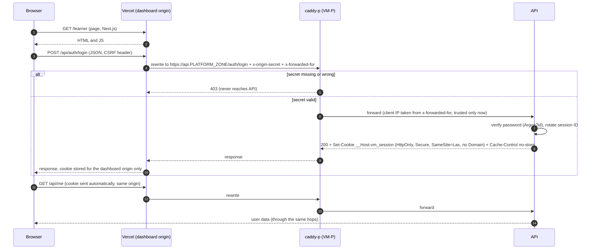
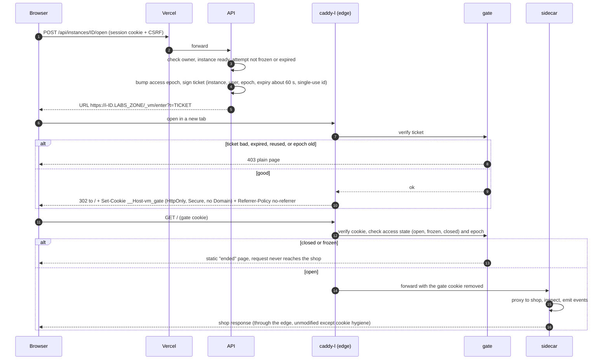
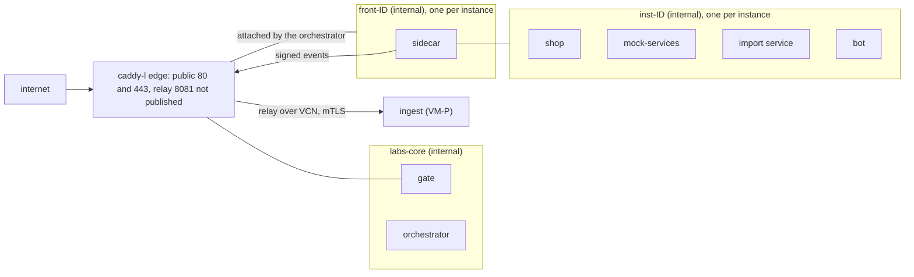
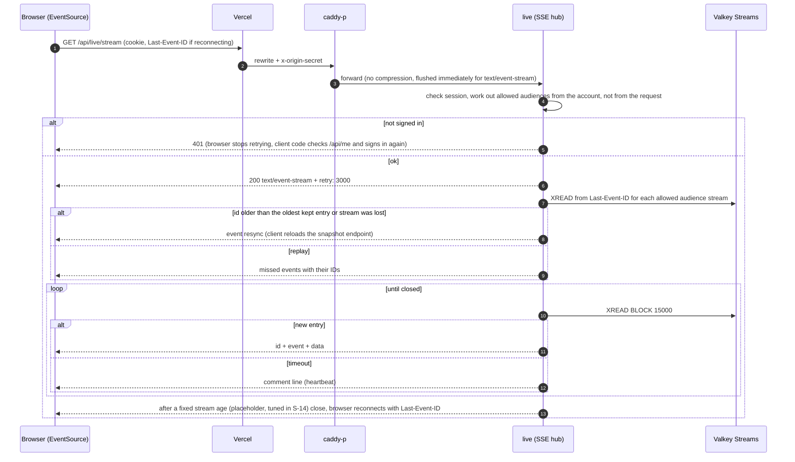

# 03. Origins, cookies, TLS and access

Status: PROPOSED (2026-10-08). Facts are cited `[EF-n]` (register in [README.md](README.md)). Related ADRs: 0002 (browser to API path), 0003 (instance addressing and TLS), 0004 (instance access gate), 0005 (network and event path), 0006 (live updates).

This document analyses four traps found while reading the PRD and proposes a way out of each. None of them contradicts a locked decision; each needs the user's confirmation of a proposal (list at the end).

| Trap | One-line resolution |
|---|---|
| (a) Dashboards on Vercel call an API on the VM (D-15), but NFR-SEC-03 wants same-origin and no open CORS, and D-21 chose session cookies | Make the browser talk only to the Vercel origin. Vercel forwards `/api/*` to the VM (external rewrite). Cookies become first-party; no CORS. Fallbacks: serve dashboards from the VM, or a domain we control |
| (b) The shop is deliberately XSS-vulnerable (C03) and must never share an origin or cookie scope with the platform | Every instance gets its own hostname in a **labs zone that is a different site** from the platform and the dashboards. The API host holds no user cookies at all. Instance access uses a one-time ticket and a host-only cookie |
| (c) Instance networks have no route out, yet the sidecar must report to the platform and the edge must reach every instance | Two internal networks per instance. The labs edge attaches to a small `front` network per instance. The sidecar's signed events travel through that edge to a private ingest listener |
| (d) SSE must reach browsers through that path | Same-origin through the rewrite with 15-second heartbeats, replay from Valkey Streams, server-side stream cap and reconnect. Plan B is a ticketed direct stream |

## 1. Trap (a): dashboards on Vercel, API on the VM

### 1.1 What the browsers do (verified)

- **Firefox** gives third-party cookies a separate jar per site (Total Cookie Protection, on by default with Enhanced Tracking Protection). **Safari** blocks third-party cookies by default (Intelligent Tracking Prevention, "cookies for cross-site resources are now blocked by default across the board"). **Chrome** does not block third-party cookies by default outside Incognito or an explicit user setting. **Edge** blocks known trackers and trackers from unvisited sites. `[EF-07]` (MDN page last modified 2026-06-15, WebKit blog). Chrome's own page read this session contained no statement about future plans, so Chrome's future behaviour is UNVERIFIED.
- A cookie is "third-party" when the page's **site** differs from the cookie host's site. The Public Suffix List treats `vercel.app` and `duckdns.org` as public suffixes, so `x.vercel.app` and `y.duckdns.org` are different sites, and so are two different DuckDNS names `[EF-08]`.

Consequence: a dashboard at `<project>.vercel.app` calling `https://<api>.duckdns.org` with a session cookie is a **cross-site** cookie. It would work in Chrome today and fail in Safari and Firefox. Server-side session cookies (D-21) cannot be used that way.

### 1.2 Options compared

| # | Option | Cookies and CSRF | CORS (NFR-SEC-03) | SSE | Needs | Verdict |
|---|---|---|---|---|---|---|
| 1 | **Vercel external rewrite**: browser calls `/api/*` on the dashboard origin, Vercel proxies to the VM | First-party host-only cookie, works in every browser `[EF-07]`. SameSite=Lax plus token plus Origin check | None needed | Through the rewrite; behaviour UNVERIFIED (spike S-14); fallback plan B | Nothing but the Vercel config. A `*.vercel.app` name is enough | **Recommended** |
| 2 | **Cross-origin direct** with an exact-origin allowlist, when both hosts are on one registrable domain we control (for example `app.example.com` and `api.example.com`) | First-party in the "same-site" sense, so Lax cookies work | Exact-origin CORS with credentials (not open, but not "same-origin through the proxy" either: wording of NFR-SEC-03 would need a tweak) | Direct, no Vercel in the stream path | A domain we control (Route A of D-16, still unconfirmed, OI-9). Dashboards on a custom Vercel domain | Good if a domain exists and S-14 fails |
| 3 | **Token-based auth** (bearer token in headers or storage) | No cookie needed; XSS and revocation concerns | CORS needed | `EventSource` cannot set headers `[EF-22]`, so needs tickets anyway | Changing D-21 | **Rejected**: conflicts with D-21 |
| 4 | **Serve the dashboards from the VM** (Next.js standalone container behind `caddy-p`, same host as `/api`) | Native same-origin | None | Direct, simplest | Moving dashboards off Vercel (changes D-15 wording), memory for a Node server on VM-P | **Fallback** if S-14 fails or Vercel terms are a problem |
| 5 | Cross-site cookies marked `SameSite=None; Secure; Partitioned` | Partitioned cookies are a Chromium feature; Safari blocks third-party cookies regardless `[EF-07]` | CORS with credentials | Direct | Browser support beyond Chromium UNVERIFIED | **Rejected** (cannot rely on it) |

### 1.3 Facts about Vercel rewrites that shape the design

- Rewrites to an external origin are supported on every plan and make Vercel act as a reverse proxy; Vercel forwards `x-real-ip`, `x-forwarded-for`, `x-forwarded-host` and `x-forwarded-proto` `[EF-01]`.
- Vercel documents a pattern to make the origin accept only its traffic: Vercel sets a secret request header with a `routes` transform and the origin rejects requests without it `[EF-01]`. We use this: `caddy-p` returns 403 to anything without `x-origin-secret`. This also means the API is **not** reachable from the open internet (a later mobile client needs a second hostname, section 8).
- **Caching trap.** For projects created on or after 2026-04-06, Vercel's external rewrites **honour upstream `Cache-Control`** by default `[EF-02]`. An authenticated JSON response with a cacheable header could be served to another user. Controls: the API sends `Cache-Control: private, no-store` on every authenticated route; `vercel.json` sets the header `x-vercel-enable-rewrite-caching: 0` on `/api/*`; spike S-14 tests two users on the same URL.
- **Time limits.** A proxied (rewritten) request may take up to 120 seconds to be answered, otherwise the error `ROUTER_EXTERNAL_TARGET_ERROR` is returned `[EF-03]`. A separate changelog says the CDN waits up to 120 seconds for the first byte and then allows the backend to continue as long as it sends data at least every 120 seconds, on all plans; it does not say whether this covers rewrites or SSE `[EF-04]`. The 15-second heartbeat is far inside both limits. The Hobby function limit of 300 seconds applies to Vercel Functions, not to rewrites `[EF-06]` (the rewrite does not run a function; this is read from the pages, not tested).
- Hobby included usage (per month): Fast Data Transfer 100 GB, Fast Origin Transfer 10 GB, CDN requests 1,000,000, function invocations 1,000,000, active CPU 4 hours `[EF-06]`. Which of these a rewritten request and a held-open stream count against is UNVERIFIED (S-14). Hobby is "non-commercial, personal use only" `[EF-06]`; the PRD already lists this as a risk (R-4).
- Not found in any primary source: whether SSE passes through a rewrite unbuffered, the longest a stream may stay open, whether `Set-Cookie` and large headers pass unchanged, whether an IP-literal destination is accepted `[EF-05]`. These are spike S-14. The design below does not depend on any of them being true: each has a fallback.

### 1.4 Request path (recommended)

Rules for this path:

1. Cookies are `__Host-` prefixed (host-only, `Path=/`, `Secure`, no `Domain`): `__Host-vm_session` (HttpOnly) and `__Host-vm_csrf` (readable, double-submit token). The cookie lives on the dashboard origin only, never on the API host or any instance host.
2. State-changing calls need the CSRF header, a JSON content type, and an `Origin` that equals `DASHBOARD_ORIGIN`. A cross-site form post fails (NFR-SEC-03).
3. The API host is cookie-free. A script in the shop that calls the API host cross-site finds no cookie to send and no origin secret to pass.
4. Rate-limit keys use the visitor IP from `x-forwarded-for`, trusted **only** when the origin secret is valid `[EF-01]`.
5. Server-side rendering that needs the user's identity forwards the cookie from the Vercel function with the origin secret and the forwarded IP. To keep the number of hops down, the dashboards are mostly client-rendered (stream P decides per page).
6. Dashboards carry a strict CSP and `frame-ancestors 'none'`; the shop is opened in a **new tab**, never an iframe, so no third-party cookie question arises for the shop either.
7. Privacy note for the data-processing terms (FR-ORG-07, FR-PRV-07): with this design Vercel proxies all API traffic, including candidate data, so it is a sub-processor in the path. The region of Vercel's proxy is not known (UNVERIFIED).

### 1.5 What this needs from the user

1. Confirm option 1 (rewrite) as the primary, with option 4 (dashboards from the VM) as the pre-agreed fallback if spike S-14 fails. Option 4 changes the wording of D-15 and is the user's call.
2. Confirm that "same-origin through the proxy" in NFR-SEC-03 may be met by the Vercel rewrite.
3. Accept that Vercel is a sub-processor in the path and that Hobby is non-commercial (R-4), or choose option 4 now.
4. A domain is **not** needed for option 1. It is needed for option 2 and for Resend sender verification (OI-9, OI-32).

## 2. Trap (b): the vulnerable shop must not share an origin or cookie scope

### 2.1 Why it matters

C03's stored XSS runs script inside the shop origin. If the shop shares an origin with the platform, that script can call the platform API with the victim's cookies. If it only shares a **site**, same-site requests still carry `SameSite=Lax` cookies, so CSRF defence must not rely on SameSite alone. The safest rule: shop hosts and platform hosts are **different sites**, and the platform's cookies never exist on any host the shop can reach.

### 2.2 Addressing options compared

| Option | Isolation between shop and platform | Isolation between instances | TLS | Network and practical issues | Verdict |
|---|---|---|---|---|---|
| **Per-instance subdomains** under a labs zone that is a different site from the platform | Strong (different site; API host cookie-free) | Different origins; same site among themselves, so a hostile instance could set a `Domain=` cookie for siblings, but `__Host-` cookies cannot be overwritten, and instances are gated to one owner | One **wildcard** certificate, which needs the DNS-01 challenge `[EF-10]` and a DNS provider with an API; or one certificate per host (no wildcard) | Only ports 80 and 443 needed | **Recommended** |
| **Per-host ports** on one hostname (`host:20001`, `host:20002`) | Weak: cookies ignore ports, so every instance and any service on the same host share cookies; the platform must live on another hostname | Weak (shared cookie jar for the host) | One certificate | Opens a large port range in Oracle's security list and the OS firewall; campus networks often block odd ports (R-10) | Rejected except as an emergency fallback (with the API on another hostname) |
| **Path-based** (`/i/<id>/` on one host) | None: all instances and the platform would be one origin, so shop XSS gets full same-origin access; shop apps with absolute URLs break | None | One certificate | Rewriting paths in a deliberately sloppy app is fragile | **Unsafe. Rejected** |

### 2.3 What the labs zone looks like for each D-16 route

D-16 order of preference: (1) free domain, (2) free dynamic-DNS name, with sslip.io-style names tested on Let's Encrypt staging, (3) the Oracle VM's IP with an IP certificate. Never plain HTTP.

| | Route 1: free domain (GitHub Student Pack, unconfirmed) | Route 2: DuckDNS names | Route 3: sslip.io names (or IP certificate) |
|---|---|---|---|
| API host | `api.<domain>` | `<apiname>.duckdns.org` | `api.<ip-dashed>.sslip.io` (or `https://<IP>` with an IP certificate) |
| Labs zone | A **separate** site is preferred, for example a DuckDNS name; `labs.<domain>` also works if the controls in 2.1 are applied | `<labsname>.duckdns.org`, instances at `i-<id>.<labsname>.duckdns.org` | `i-<id>.<ip-dashed>.sslip.io` |
| Certificates | Wildcard for `*.labs.<domain>` by DNS-01 if the DNS host has an API; unknown | Wildcard `*.<labsname>.duckdns.org` by DNS-01 using DuckDNS's TXT update API (the spec says the TXT value "can be used for example to prove your ownership with letsencrypt.org" and applies to all sub-subdomains) `[EF-14]` | **No wildcard** (sslip.io and nip.io do not maintain one `[EF-13]`): one certificate per hostname by HTTP-01 |
| Does wildcard DNS resolve? | Yes if we control the zone | The DuckDNS spec does not say that `*.name.duckdns.org` resolves (UNVERIFIED, spike S-16) | Yes by design: any name with an embedded IP resolves to it `[EF-13]` |
| Sites | API and labs: same site only if same domain | `duckdns.org` is on the Public Suffix List, so API, labs and dashboards are three different sites `[EF-08]` | `sslip.io` was not found in the list text read (final 3,721 characters unread), so assume API and labs may be the same site; the cookie-free API and the origin-secret rule make this acceptable |
| Email sender domain | Resend can verify it | DuckDNS gives one TXT value that applies to all sub-subdomains, so separate SPF and DKIM records are not possible (inference); use Brevo single-sender (OI-32) | Same as Route 2 |
| Rate limits (Let's Encrypt) | Normal | Wildcard is one certificate per renewal, far below limits | 50 certificates per registered domain per 7 days, 5 duplicates per identical set, 5 failed validations per identifier per hour `[EF-09]`; sslip.io says Let's Encrypt raised its own limit to 250,000 certificates `[EF-13]`, so per-host issuance is allowed but depends on that arrangement lasting |
| Port 80 | Optional if DNS-01 is used | Can be closed completely (DNS-01) | Needed for HTTP-01 and then only answers the challenge and a redirect |
| Start-up cost | None | None | A certificate request per new instance host, in the start path (seconds, and a new external dependency in FR-INS-01). Mitigation: a **pool of pre-issued slot hostnames** (for example `s01` to `sNN`) reused across instances, so no issuance at start; the gate still protects every slot |

IP certificates (Route 3 variant): Let's Encrypt IP certificates use only the `shortlived` profile, 160 hours, identifier types DNS and IP `[EF-11]`; validation by HTTP-01 or TLS-ALPN-01 (D-16 sources); each IPv4 address counts as its own registered domain for rate limits `[EF-09]`. Caddy's support is CONFLICTING: a maintainer says it works, community reports say IPv4 works and a tracking issue remains open, one user reported a rejection `[EF-12]`. An IP certificate covers only the bare IP, so instances still need hostnames; it matters only if the API must be reached as `https://<IP>`, which sslip.io names make unnecessary. Whether Vercel accepts an IP-literal rewrite destination is UNVERIFIED (S-14).

**Recommended default:** Route 2 for both API and labs (separate DuckDNS names), because it gives a wildcard certificate, closes port 80, and separates sites. If S-16 shows that wildcard resolution does not work, use Route 3 with the slot-pool. If a free domain appears (OI-9), move the API and email to it and keep the labs zone on its own site.

### 2.4 Instance host format and rules

- Hostname: `i-<id>.<LABS_ZONE>` where `<id>` is 16 random base32 characters (about 80 bits). Unguessability is only a first layer; the gate (section 3) is the control.
- `/_vm/` is a reserved path prefix on every instance host for the edge and gate; the shop must not use it (written in the instance contract).
- The edge must not add a Content-Security-Policy or other security headers to shop responses (it would change what XSS can do and break C03). It adds only `/_vm/*` responses and removes its own gate cookie before forwarding.
- Instances are opened in a new browser tab from the dashboard.

### 2.5 What "never plain HTTP" (D-16) means for instances

Three places could be plain HTTP. The architecture proposes the reading below; the user chooses.

| Segment | Proposal | Alternative |
|---|---|---|
| Browser to labs edge (public) | HTTPS only. Port 80 closed (DNS-01 routes) or answering only the challenge and a redirect (HTTP-01 routes). HSTS on instance hosts is **not** set by the edge (it would persist in the player's browser for the zone) | Strict: close port 80 completely on all routes |
| Labs edge to sidecar on `front-<id>` | Plain HTTP on a private internal network that contains only those two containers | **Re-encrypt** with a per-instance private certificate (extra start time and moving parts) |
| Inside an instance (shop, import, mock, bot) | Plain HTTP on the internal network (no third party present; the shop is the target) | None proposed |
| Local development and laptop fallback | Plain HTTP on loopback only | Local certificates with a local CA (more setup) |

## 3. Instance access gate (ADR 0004)

Requirements: FR-INS-10 (only the owner reaches an instance), FR-SES-11 (one active browser session binds the instance address), FR-SES-04 (frozen instance accepts no player requests).

- **Ticket**: HMAC-signed, about 60 seconds, single use (the gate remembers used IDs). It travels in a URL once and is useless afterwards.
- **Cookie**: `__Host-vm_gate`, session-lifetime, signed, carries instance ID, user ID and access epoch. A sibling instance cannot overwrite a `__Host-` cookie, and the shop never sees it (the edge strips it).
- **One active browser session (FR-SES-11)**: every new `open` or login raises the instance's **access epoch** on the API, which pushes it to the gate through the orchestrator. Older cookies carry the old epoch and are refused.
- **Freeze, expiry and withdrawal**: the orchestrator tells the gate to switch the instance to `frozen` or `closed`; the door closes within one push, without waiting for containers to stop.
- **Key**: the gate verification key is shared between the API and the gate only (ADR 0009). A forged ticket would open only instances (the hostile zone) and never reach the platform.
- **Activity signal (FR-INS-03)**: the sidecar reports aggregated "last request" times in its events; the dashboard sends a visibility-based heartbeat to the API. Together they define inactivity. An open SSE stream does **not** count as activity.

## 4. Trap (c): network contradiction

Contradiction: D-23 and NFR-ISO-04 say instance networks are internal and platform networks are unreachable, yet (1) the sidecar must send signed events to the platform and (2) the edge must reach every instance.

Resolution (details in ADR 0005 and [02](02-deployment-and-network.md) section 7):

Why it works:

1. **Inbound**: the edge reaches each instance through `front-<id>`, a network that holds only the sidecar and the edge. The orchestrator attaches the edge when it creates the instance and detaches it when it destroys it. The shop, import service, mock-services and bot are on `inst-<id>` only; they cannot see `front-<id>`.
2. **Outbound**: the sidecar is attached to both networks. It posts to the edge's relay listener (port 8081, not published to the host). The relay accepts only `POST /internal/v1/events` with a size limit and forwards it to `ingest` over the private VCN link. Nothing else is relayed.
3. **No lateral path**: each `front-<id>` is a separate network, so sidecars of different instances cannot reach each other. An instance has no route to the database, Valkey, the orchestrator or another instance, and not to the host (INPUT rule, [02](02-deployment-and-network.md) section 9).
4. **Signing**: the sidecar holds a per-instance key derived on the platform and passed in at start; the shop never has it. App events from the shop reach the sidecar over `inst-<id>` and are labelled `source: app` when the sidecar signs them (ADR 0009).
5. **Edge as a hub**: the edge is the only container with many instance-zone legs, so it is kept minimal (non-root, read-only, no shell, only Caddy and a small module set) and routes by hostname with a strict pattern (`i-<16 base32>`), so a crafted Host header cannot reach anything but a sidecar alias. Whether the platform can attach one container to many networks without trouble is spike S-15.
6. **Cost**: each instance consumes two Docker networks and address space. The daemon is configured with a dedicated, smaller address pool for them (value to choose in S-15).

## 5. Trap (d): SSE through the chosen path

Requirements: FR-LIV-01 to 06 and D-17: event IDs, replay, `Last-Event-ID`, heartbeat about every 15 seconds, no proxy buffering, HTTP/2, snapshot and polling fallback.

Browser facts (verified, `[EF-22]`): the browser sends `Last-Event-ID` automatically on reconnect; a response that is not 200 with `text/event-stream` (including 204 and 401) **stops reconnection**; the `retry:` field sets the reconnect delay; a comment line every 15 seconds or so keeps proxies from dropping the connection; `EventSource` cannot set custom request headers; without HTTP/2 a browser allows only six connections per host and domain.

Design points:

- **Source of truth**: the API writes a domain-event row in the same transaction as the change (outbox); a relay publishes it to Valkey Streams. A lost stream is always recoverable from the snapshot endpoint.
- **IDs and replay**: Valkey stream entry IDs (time-sequence) are used directly as SSE `id:`. Streams are trimmed by age or length (`MAXLEN ~` or `MINID`) `[EF-24]`. `XREAD BLOCK <ms>` doubles as the heartbeat timer; `$` is used only for the very first read `[EF-24]`.
- **Authorisation (FR-LIV-05)**: the hub derives the audience list from the session (the user's own stream; the organisation stream for recruiters; admin streams for admins). A client never names a stream. Publishers decide the audience when they publish. The hub re-checks the session on every heartbeat tick and on a revoke message.
- **Cap and reconnect**: the hub closes every stream after a fixed age and the browser reconnects with `Last-Event-ID`. This stays correct even if a Vercel or proxy cap exists that we have not found `[EF-05]`, and it re-validates the session regularly.
- **No buffering**: Caddy flushes `text/event-stream` responses immediately `[EF-23]`; the response also carries `Cache-Control: no-store` and `X-Accel-Buffering: no` (FR-LIV-02); the stream route is excluded from response compression.
- **Fallback ladder**: (1) rewrite (primary); (2) **plan B, ticketed direct stream**: the dashboard asks `POST /api/live/ticket` and opens `EventSource` directly against the API host with a one-time ticket in the URL; the API host then allows exactly one CORS origin (`DASHBOARD_ORIGIN`, without credentials) on that single route, and the edge does not log the query string; (3) polling of the snapshot endpoint (D-17); (4) dashboards served from the VM. Plan B needs the user's agreement because NFR-SEC-03 says "no open CORS" (an exact allowlist is not open CORS, but it is cross-origin).
- **HTTP/2**: the browser to Vercel leg is expected to be HTTP/2, which avoids the six-connection limit `[EF-22]`; this is UNVERIFIED for the Hobby plan and checked in S-2. The Vercel to origin protocol is not documented; Caddy accepts HTTP/1.1 and HTTP/2.

## 6. Site relationships at a glance

| Pair | Route 1 (domain) | Route 2 (DuckDNS) | Route 3 (sslip.io) |
|---|---|---|---|
| Dashboard origin to API host | Cross-origin, but the browser never calls it directly (rewrite) | same | same |
| API host to labs hosts | Same site if one domain, else different | Different sites (PSL) | Possibly the same site, acceptable because the API host holds no cookies |
| Labs host to labs host | Same site, different origins | Same site | Same site |
| Platform session cookie reachable from any labs host | No (cookie exists only on the dashboard origin) | No | No |

## 7. Things the user must provide or confirm

1. Which D-16 route to try first, and whether the GitHub Student Pack offered a free domain (Q-30, OI-9).
2. Acceptance of the rewrite design and its fallbacks (section 1.5), including Vercel as sub-processor and the Hobby terms (R-4).
3. The reading of "never plain HTTP" for instances (section 2.5).
4. The email route (OI-32): Resend needs a verified sender domain, which DuckDNS cannot provide.
5. Agreement that local development and the laptop fallback may use plain HTTP on loopback.

## 8. Notes for later extension

A mobile or third-party client needs a second public API hostname with token-based authentication on a separate audience. The cookie-free API host and the origin-secret rule make that a new route in `caddy-p`, not a redesign.
