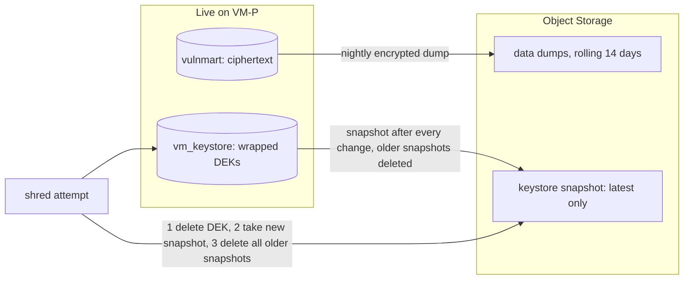
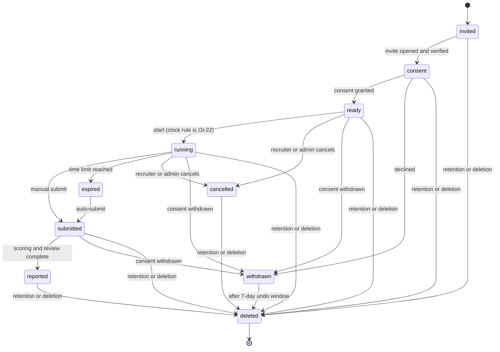
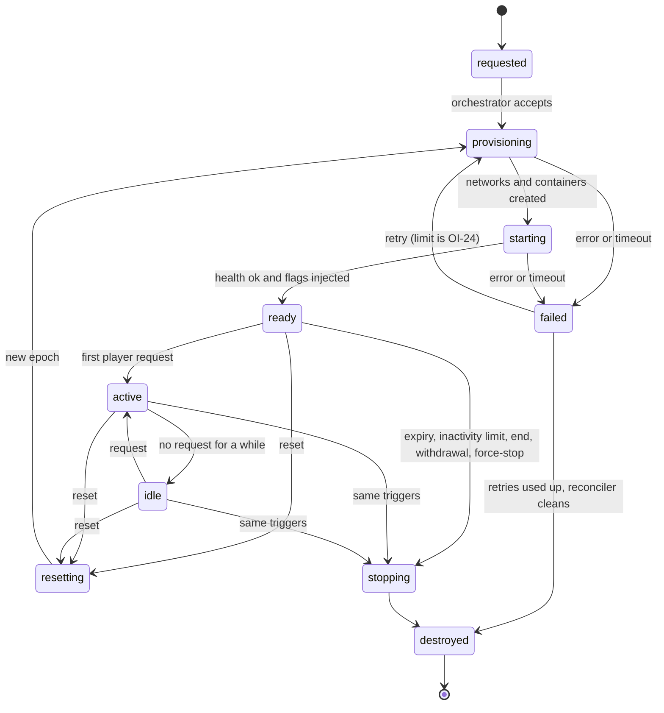
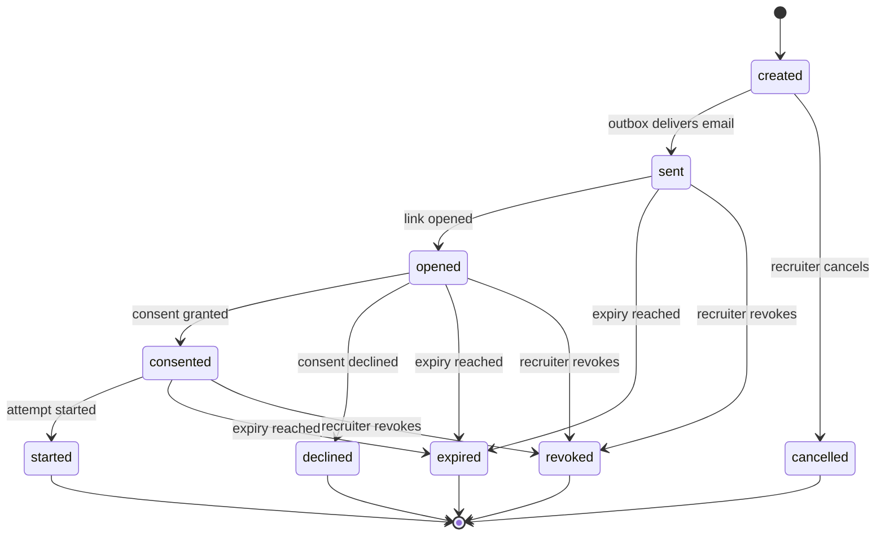
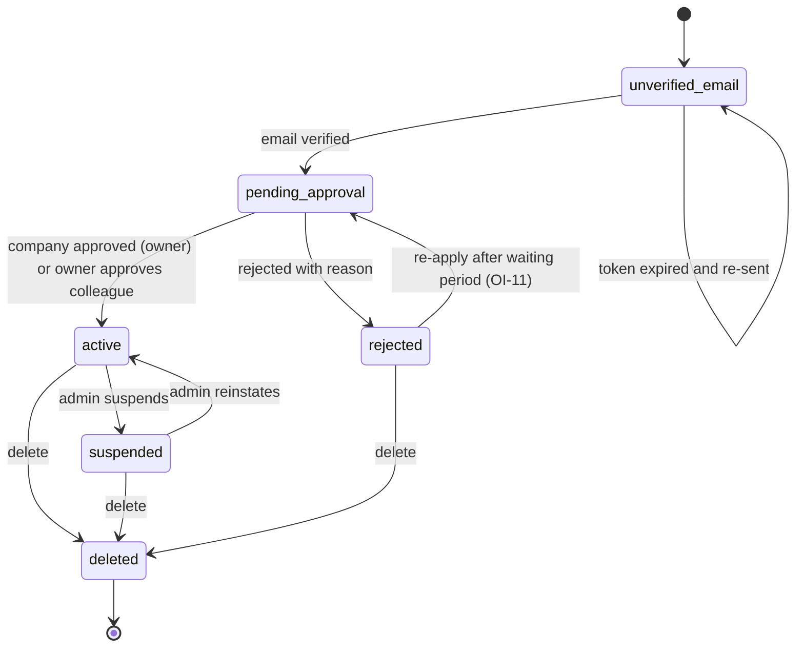
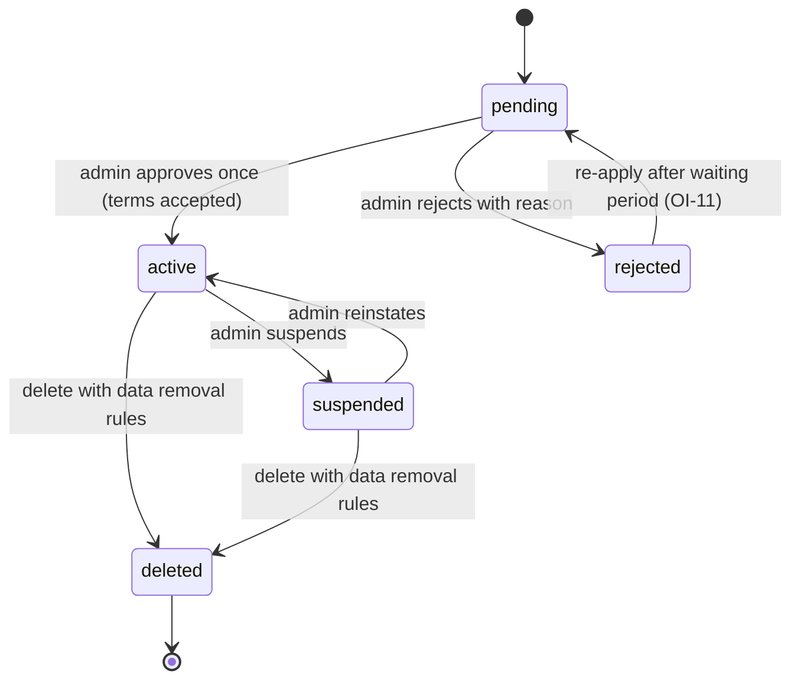

# 04. Data and state

Status: PROPOSED (2026-10-08). Facts cited `[EF-n]` (register in [README.md](README.md)). Related ADRs: 0006 (live updates), 0008 (data placement, backups, anchor, keystore), 0009 (keys and secrets), 0014 (organization scoping). Requirement IDs refer to [PRD.md](../prd/PRD.md).

Plain terms: a **migration** is a versioned change to the database structure. **Row-Level Security (RLS)** is a PostgreSQL feature that filters rows by rule inside the database. A **DEK** is a data-encryption key (one per attempt); a **KEK** is the key-encryption key that locks DEKs. **Crypto-shredding** means deleting a key so that encrypted data, including copies in backups, can no longer be read.

## 1. Principles

1. **PostgreSQL is the truth. Valkey is transport.** Anything in Valkey can be rebuilt from Postgres or is safe to lose (queues are re-created from outbox rows).
2. **One writer.** Only the API codebase (API, ingest, SSE hub, workers, scheduler are processes of it) writes the platform database (NFR-MNT-02). The orchestrator reports to the API; the shop and sidecar only send signed events.
3. **Module ownership.** Each table has one owning module (and so one work-stream). Other modules use its Python interface, not its tables ([07](07-repo-and-workstreams.md)).
4. **Minimum data.** Events hold metadata only (FR-DET-08). Only the flag-capturing request is kept as evidence, encrypted per attempt (FR-DET-03, FR-PRV-12).
5. **No flag, token or key value in any table.** Hashes and key identifiers only.

## 2. Platform database outline

Two databases in one PostgreSQL 18 cluster: `vulnmart` (everything below) and `vm_keystore` (section 5). Primary keys are UUIDs unless stated. Every table has `created_at`; mutable tables have `updated_at`. Streams: **P** = platform and dashboards, **L** = lab (instance plane and scoring), **T** = target and challenges (writes no database tables; owns catalogue files).

### 2.1 Identity (stream P)

| Table | Key columns | Notes |
|---|---|---|
| `users` | `id`, `account_type` (`participant`, `recruiter`, `admin`), `email_ci` (unique, case-insensitive), `email_verified_at`, `password_hash` (Argon2id), `display_name`, `status`, `age_declared_at`, `last_login_at`, `deleted_at` | `account_type` enforces FR-ACC-05: a check constraint stops a recruiter or admin from holding participant roles |
| `user_roles` | `user_id`, `role` (`learner`, `candidate`) | Participants only (D-05) |
| `mfa_credentials` | `user_id`, `type` (`totp`), `secret_enc`, `enabled_at`, `last_used_step` | Secret encrypted with an application field key; required for admin (FR-ACC-07) |
| `recovery_codes` | `user_id`, `code_hash`, `used_at` | Hashes only |
| `sessions` | `id_hash`, `user_id`, `created_at`, `last_seen_at`, `absolute_expires_at`, `ip_trunc`, `ua_class`, `revoked_at` | Server-side sessions (D-21). Opaque ID stored hashed. Valkey caches active sessions |
| `email_tokens` | `token_hash`, `user_id`, `purpose` (`verify`, `reset`), `expires_at`, `used_at` | Single-use, stored as a hash (FR-ACC-02, FR-ACC-08) |

### 2.2 Organizations (stream P)

| Table | Key columns | Notes |
|---|---|---|
| `organizations` | `id`, `name`, `email_domain`, `status` (state machine below), `owner_user_id`, `rejected_reason`, `suspended_reason` | `org_id` root for scoping |
| `org_members` | `org_id`, `user_id`, `role` (`owner`, `member`), `status` | |
| `join_requests` | `org_id`, `user_id`, `status`, `decided_by` | Owner decides (FR-ORG-03) |
| `dpa_acceptances` | `org_id`, `user_id`, `terms_version`, `accepted_at` | FR-ORG-07 |

### 2.3 Catalogue (content owned by T, tables read by P and L)

Loaded from `challenges/catalog/*.yaml` by a sync job at deploy time (NFR-EXT-02). Contains **no flags and no secrets**.

| Table | Key columns |
|---|---|
| `challenges` | `key` (C01..C11), `title`, `owasp_2021`, `owasp_2025`, `cwe[]`, `attack[]`, `difficulty` (1..5), `tier`, `weight`, `target_type`, `active` |
| `challenge_milestones` | `challenge_key`, `level` (1..3), `share_pct`, `definition_ref` (what event counts, OI-17) |
| `challenge_hints` | `challenge_key`, `level`, `text` |
| `challenge_writeups` | `challenge_key`, `body` |

### 2.4 Assessments and consent (stream P)

| Table | Key columns | Notes |
|---|---|---|
| `assessment_templates` | `id`, `org_id`, `title`, `time_limit_min`, `hints_mode`, `hint_cost_pct`, `reset_limit`, `invite_expiry_days`, `retention_days`, `settings jsonb` | A template used by started attempts is frozen: attempts copy the rules at start (FR-ASM-01) |
| `template_challenges` | `template_id`, `challenge_key` | |
| `invites` | `id`, `org_id`, `template_id`, `email_ci`, `token_hash`, `state`, `expires_at`, `superseded_by` | State machine below. Token is at least 128 bits, stored as a hash (FR-ASM-02) |
| `consent_records` | `id`, `user_id`, `org_id`, `template_id`, `notice_version`, `notice_text_sha256`, `notice_text_snapshot`, `retention_days_shown`, `controller_name_shown`, `action` (`granted`, `declined`, `withdrawn`), `at`, `ip_hash`, `ua_hash`, `method`, `audit_seq` | **Append-only** (no UPDATE or DELETE grant). `audit_seq` links into the audit chain (FR-PRV-02) |

### 2.5 Attempts and instances (stream L)

| Table | Key columns | Notes |
|---|---|---|
| `attempts` | `id`, `org_id` (null for learner practice), `user_id`, `mode` (`learner`, `candidate`), `template_id`, `invite_id`, `consent_id`, `state`, `ready_at`, `started_at`, `deadline_at`, `submitted_at`, `frozen_until`, `superseded_by`, `rules jsonb` (copied template rules), `dek_id` | Owns the attempt state machine and the server clock (FR-SES-02). `org_id` set for candidate attempts, so recruiters are scoped by it; participants by `user_id` |
| `instance_hosts` | `id`, `kind` (`oracle`, `laptop`, `paid`), `orchestrator_url`, `labs_zone`, `capacity_memory_mb`, `org_id` (null) | Instance host is data (NFR-EXT-04) |
| `instances` | `id`, `attempt_id`, `owner_user_id`, `host_id`, `template_id` (allowlist name), `state`, `access` (`open`, `frozen`, `closed`), `access_epoch`, `epoch` (flag epoch), `flag_key_version`, `event_key_version`, `hostname`, `requested_at`, `ready_at`, `last_activity_at`, `expires_at`, `destroyed_at`, `last_error_code` | State machine below. The orchestrator is the authority, the API stores what it reports (section 2.2 of [01](01-overview-and-components.md)) |
| `instance_transitions` | `instance_id`, `from_state`, `to_state`, `at`, `reason` | History for support and capacity (no personal data) |
| `instance_epochs` | `instance_id`, `epoch`, `flag_key_version`, `started_at`, `ended_at` | Lets the platform recognise a stale flag from before a reset |

### 2.6 Events, scoring and evidence (stream L)

| Table | Key columns | Notes |
|---|---|---|
| `events` | `id`, `instance_id`, `attempt_id`, `seq`, `source` (`sidecar`, `app`, `orchestrator`, `platform`), `type`, `ts_instance`, `ts_received`, `payload jsonb` (metadata only) | Unique `(instance_id, seq)` makes ingestion idempotent (FR-DET-04). Request summaries are aggregated by the sidecar, not one row per request |
| `milestones` | `attempt_id`, `challenge_key`, `level`, `reached_at`, `event_id`, `status` (`credited`, `held`, `rejected`), `decided_by`, `decision_note` | Best level per challenge counts once (FR-SCR-02) |
| `flag_submissions` | `attempt_id`, `challenge_key`, `result` (`correct`, `wrong`, `decoy`, `other_instance`, `stale_epoch`), `at` | **No submitted value is stored** (FR-FLG-05) |
| `hint_unlocks` | `attempt_id`, `challenge_key`, `level`, `cost_pct`, `at` | |
| `evidence` | `id`, `attempt_id`, `challenge_key`, `ciphertext`, `nonce`, `dek_id`, `kek_version`, `size`, `captured_at` | AES-256-GCM under the attempt DEK; body capped (8 KB, FR-DET-03); `Authorization`, cookies and password fields redacted before encryption |
| `integrity_flags` | `id`, `attempt_id`, `type` (`decoy`, `sharing`, `timing`, `activity`, `similarity`), `explanation`, `status`, `decided_by`, `decision_note` | Evidence for a human, never an automatic fail (FR-ACH-06). Held captures are `milestones.status = held` linked here |
| `score_snapshots` | `attempt_id`, `score`, `per_challenge jsonb`, `computed_at`, `version` | Recomputed from milestones, hints and decisions; the dashboards read this |
| `activity_buckets` | `attempt_id`, `bucket_start`, `request_count`, `rule_tags jsonb` | Basis for active time and the activity check (FR-TIM-02, FR-ACH-02) |

### 2.7 Privacy, admin and operations (stream P)

| Table | Key columns | Notes |
|---|---|---|
| `deletion_requests` | `id`, `subject_user_id`, `org_id`, `attempt_id`, `status`, `due_at`, `approved_at`, `executed_at` | FR-PRV-08, 14-day decision and 30-day execution placeholders |
| `subject_map` | `subject_id`, `user_id` | Pseudonym mapping used by the audit log; **deleted** when a person is deleted (FR-PRV-10) |
| `break_glass_sessions` | `id`, `admin_id`, `attempt_id`, `reason`, `started_at`, `expires_at`, `reviewed_by`, `reviewed_at`, `what_read` | FR-ADM-03 (duration OI-12) |
| `settings` | `key`, `value`, `updated_by`, `updated_at` | Quotas, global instance cap, retention defaults, invite cap (FR-ADM-05) |
| `quotas` | `scope` (`user`, `org`, `global`), `scope_id`, `max_instances` | OI-21 |
| `job_runs` | `job`, `started_at`, `finished_at`, `status`, `detail` | Shown on the Admin dashboard (FR-PRV-18) |
| `email_outbox` | `id`, `template`, `to_user_id`, `params jsonb`, `state`, `attempts`, `next_attempt_at` | Written in the same transaction as the cause (FR-NTF-02) |
| `domain_events` | `id bigserial`, `audience`, `type`, `payload jsonb`, `created_at`, `published_at` | Outbox for live updates (ADR 0006) |

### 2.8 Audit (stream P)

| Table | Key columns |
|---|---|
| `audit_log` | `seq bigserial`, `at`, `actor_subject`, `actor_type`, `action`, `target_type`, `target_id`, `org_id`, `result`, `ip_trunc`, `meta jsonb`, `prev_hash`, `row_hash` |
| `audit_checkpoint` | `seq`, `hash`, `reason` (written when old rows are purged) |
| `audit_anchor` | `anchor_date`, `head_seq`, `head_hash`, `anchored_at`, `witness` |

## 3. Organization filtering in one place

Rule (FR-ORG-06, NFR-EXT-01): every recruiter-owned row has `org_id`, and **one piece of code** adds the filter. Two layers (ADR 0014):

1. **Application layer.** A single database-session class applies an organization filter to every query on tables that carry `org_id`. If a query touches such a table and the session has no organization scope, it **raises an error** instead of returning rows (the "missing filter fails a test" criterion).
2. **Database layer.** PostgreSQL Row-Level Security on the same tables with a policy comparing `org_id` to a per-transaction setting. By default a table owner and any role with BYPASSRLS skip RLS, and a table with RLS enabled and no policy shows no rows `[EF-25]`, so the application connects as a role that is **not** the table owner and has no BYPASSRLS, and the tables use `FORCE ROW LEVEL SECURITY`. Setting the variable per transaction is a common pattern, not in the page read `[EF-25]`.

A second scope exists for participants: rows owned by a person are filtered by `user_id`. Tests (FR-DSH-06, NFR-SEC-08) try cross-user and cross-company reads for every role against every list and detail route; the 404-versus-403 choice is the same for "missing" and "not yours" so identifiers cannot be probed.

## 4. Audit log, hash chain and anchor

**Row hash.** `row_hash = SHA-256(prev_hash || canonical JSON of the row without row_hash)`. Rows contain only pseudonymous subject IDs, never names or emails (FR-PRV-10).

**Writers.** One function `append_audit(...)` inserts a row inside a transaction holding an advisory lock on the chain, so rows are strictly ordered with no gaps and the chain stays correct under concurrent writes. Volume is low (logins, views, admin actions), so serialisation is fine. This is tested in spike S-10.

**Database roles.** `audit_writer` may only INSERT. The application's normal role has no UPDATE or DELETE on the audit tables. A separate `audit_purger` role may delete rows older than 12 months only through a function that writes an `audit_checkpoint` row with the hash that precedes the new first row, so the chain verifies from the checkpoint.

**Deleting a person.** The `subject_map` row is deleted. Audit rows stay and identify nobody (FR-PRV-10); the chain is unaffected because hashes cover pseudonymous values only.

**Verification and anchor.** A scheduled job re-walks the chain daily and publishes the head (`seq`, `hash`, date) outside the database so a whole-chain rewrite is detectable. Where it is anchored is part of OI-28 (ADR 0008): proposed is a signed one-line commit per day to a separate private repository plus an email to the admins. The line contains a hash only, no personal data.

**What is logged.** Every item in FR-PRV-10, plus admin reads, break-glass start and end, held-capture decisions, orchestrator actions (NFR-SEC-04), exports (FR-EXP-04), and failed access attempts.

## 5. Consent records, per-attempt keys and crypto-shredding

### 5.1 Consent
`consent_records` is append-only. A grant, decline or withdrawal each adds a row that stores the notice version, the exact text shown (snapshot and hash), the retention and company shown, hashed IP and browser, the method, and the audit sequence number (FR-PRV-02). Minimal retention after the assessment record is deleted is OI-37.

### 5.2 Keys
- One **DEK per attempt** (random 256-bit), used with AES-256-GCM to encrypt that attempt's evidence and answers. PRD wording says "per-assessment key" (D-25, FR-PRV-12); deleting **one** candidate while others in the same assessment remain needs a key per candidate attempt, so the architecture uses a per-attempt key (listed as PRD issue P-9 in README for the user to confirm).
- A **KEK** (key-encryption key, versioned) wraps DEKs. The KEK is a file secret on VM-P (ADR 0009).
- Wrapped DEKs live in the separate `vm_keystore` database, **not** in `vulnmart`. The `vulnmart` database and the keystore are backed up under **different rules**.

### 5.3 Shredding rule that survives backups
Problem: if the wrapped DEK sat in the same rolling backups as the ciphertext, restoring any backup within 14 days would bring the data back, so deleting the key would not erase it (the goal of FR-PRV-12 and spike S-10).



Shredding an attempt: delete the DEK row; take a new keystore snapshot; delete every older snapshot. The data dumps still contain ciphertext, but no copy of the DEK exists anywhere, so it cannot be decrypted. A restore test (S-19): restore a 10-day-old data dump and the latest keystore snapshot; shredded attempts must be unreadable, live ones readable. Trade-off: the keystore has no history, so a corrupted keystore means unreadable data; mitigation is two latest copies in different places and an offline copy of the KEK.

## 6. Retention and scheduler jobs

Jobs are idempotent and recorded in `job_runs`; failures alert the Admin (FR-PRV-18, SM-8).

| Job | Cadence | Rule | Source |
|---|---|---|---|
| Candidate retention sweep | Hourly | Delete attempts whose retention date passed (default 180 days after attempt end, or after invite date if never started; 30 to 365): attempt data, evidence, milestones, shred DEK | FR-PRV-04 |
| Learner retention warning | Daily | Email 30 days before deletion at 12 months after last login | FR-PRV-05 |
| Learner deletion | Daily | Delete learner data 12 months after last login; login before the date cancels | FR-PRV-05 |
| Evidence expiry (learner) | Daily | Delete captured evidence 30 days after the instance is destroyed | FR-PRV-06 |
| Deletion-request executor | Hourly | Execute approved requests within 30 days (placeholder); undo window of 7 days before consent-withdrawal or learner deletion runs | FR-PRV-08, 09 |
| Invite purge | Daily | Purge expired invite tokens (hashes) | FR-PRV-18 |
| IP and browser truncation | Daily | Truncate or drop IP and browser details after 90 days for learners | FR-PRV-14 |
| Log purge | Daily | Purge security and system logs after 12 months; run `audit_purger` for old audit rows | FR-PRV-15, FR-PRV-10 |
| Container-log reaper | Hourly | Raw instance logs at most 7 days | FR-PRV-06 |
| Audit verify and anchor | Daily | Re-walk chain, publish head | FR-PRV-10 |
| Backup and keystore snapshot | Nightly and on change | Section 7 | NFR-AVL-05 |
| Restore drill | Monthly (placeholder) | Restore into a scratch database and check | NFR-AVL-05 |
| Attempt timers | Per attempt | Warnings, expiry, freeze end, destroy | FR-SES-03, 04 |
| Invite expiry | Per invite | Move to expired at the template expiry | FR-ASM-03 |

The scheduler is a small leader-elected loop (Postgres advisory lock, so two copies never both run) that enqueues Dramatiq jobs; per-attempt timers are rows with a due time that the loop scans.

## 7. Valkey usage

| Use | Keys (examples) | Lifetime | Loss impact |
|---|---|---|---|
| Dramatiq queues and retries | `dramatiq:*` | Until processed | Unacknowledged jobs lost; outbox and scheduler recreate them |
| Rate limits (FR-ACC-10, FR-ACH-01) | `rl:<scope>:<id>` | Window length | Limits reset (fails open for a short time) |
| Session cache | `sess:<hash>` | Session timeouts (30 min idle, admin 15, 12 h absolute, FR-ACC-04) | Falls back to Postgres |
| SSE replay buffer (D-17) | `live:user:<id>`, `live:org:<id>`, `live:admin` as Streams | Trimmed by age or length `[EF-24]` | Clients get `resync` and reload the snapshot |
| Ingest idempotency and event stream | `evt:in` stream, `evt:seen:<instance>:<seq>` | Short | Duplicates are still rejected by the unique constraint in Postgres |
| Counters for the capacity view | `metrics:*` | Short | Gaps in the Admin view |

Configuration: append-only persistence on (`everysec`), memory limit with a no-eviction policy for queue and stream databases, a password, reachable only on `plat-data`. Valkey is BSD-licensed (D-21).

## 8. Where PostgreSQL and Valkey run, backups, anchor (OI-28)

| Option | What | For | Against |
|---|---|---|---|
| **A. Self-host on the platform VM (recommended)** | Postgres 18 and Valkey containers on VM-P, internal network, off-VM encrypted backups | Data stays in one place we control (the privacy story for candidate data), no sleeping or quota surprises, fast queue and stream access, RS-A suggests it when the API shares the machine | We operate backups and restores; a lost VM needs a restore |
| B. Managed free tiers (Neon plus Upstash) | Postgres 1 GB and 5-minute idle suspend (RS-A); Valkey-compatible store with 500K commands per month (RS-A, verified there) | No database operations | Idle suspend adds first-request delay; a command quota that Dramatiq, rate limits and blocking stream reads could exhaust; candidate data in a third-party region (DPDP processor story); two more vendors |
| C. Managed Postgres, self-host Valkey | Mix | Database durability off the VM | Still a sleeping database and a third-party processor |

Recommendation A. Backups: nightly logical dump of `vulnmart` and a separate dump of `vm_keystore`, encrypted before leaving the VM, stored in OCI Object Storage (20 GB and 50,000 requests per month are included `[EF-21]`) with a 14-day lifecycle rule for data dumps and the latest-only rule for the keystore (section 5.3). A boot-volume backup (Always Free allows five volume backups in total `[EF-21]`) of each VM is kept for rebuilds. Restore drills are monthly (placeholder).

**Audit anchor options:** (1) a signed one-line commit per day to a separate private repository by SSH deploy key; (2) email the head hash to the Admins through the outbox; (3) an object in Object Storage. The anchor must live outside the VM that holds the log. Recommendation: (1) plus (2) (two independent witnesses, hash only). Decision for the user (ADR 0008).

## 9. Instance data and lifecycle

| Item | Where it lives | Created | Gone when |
|---|---|---|---|
| Images (no flags, no secrets) | Registry and the VM image store | CI | Replaced by newer digest |
| Flags and decoys | Shop database rows and read-only files inside the instance; flag **digests** inside the sidecar only | At instance start (injector reads stdin, never environment, except where a challenge's path needs it) | Instance destroyed or reset |
| Per-instance event key | Sidecar process | At start | Instance destroyed |
| Shop SQLite and catalog files | In-instance memory-backed temp storage (candidate behaviour depends on OI-23) | Copied from the CI snapshot at start | Instance destroyed |
| Raw container logs | Docker log store | Run time | At most 7 days (FR-PRV-06) |
| Metadata events | `events`, `activity_buckets` | Ingestion | With the attempt's retention (candidate) or 12 months after last login (learner) |
| Evidence (capturing request) | `evidence`, encrypted | On capture | 30 days after instance destroyed (learner), attempt retention (candidate), or earlier on deletion or key shred |
| Instance record | `instances`, `instance_transitions`, `instance_epochs` | Request | With the attempt |

Lifecycle: request, provision (networks, containers, attach edge), inject flags, health check, ready, active or idle, then expiry, freeze, stop, destroy; reset destroys and re-creates with a new epoch ([05](05-key-flows.md)).

## 10. State machines

### 10.1 Attempt (FR-SES-08, no paused state, C-1)



The 15-minute freeze after `submitted` is not a state of its own; it is the `frozen_until` column and the instance `access` flag.

### 10.2 Instance (FR-INS-07)



Orthogonal column `access`: `open`, `frozen` (candidate cannot send requests, platform finishes writing), `closed`.

### 10.3 Invite (FR-ASM-03)



A resend creates a new token and kills the old one; a re-issue after expiry, decline or revocation creates a new invite (FR-ASM-03, FR-ASM-05).

### 10.4 Recruiter (FR-ORG-01)



### 10.5 Company (FR-ORG-02, FR-ORG-05)



Colleague joining is a second small machine on `join_requests`: `requested`, then `approved` or `rejected` by the owner (FR-ORG-03). An organization cannot invite candidates before the data-processing terms are accepted (FR-ORG-07).

### 10.6 The shop's seven state machines

Seller approval, product, checkout, fulfilment (per order item), refund, dispute and payout are defined in [RS-G section 1.1](../research/RS-G-shop-domain.md) and FR-SHP-04. They live **inside the instance's SQLite database** and are owned by the target stream (T). The platform never reads them; it sees only app events the shop emits (for example `state_change`).

## 11. Flag derivation and verification

### 11.1 Derivation (D-02, D-23, FR-FLG-01, 02)

Domain-separated HMAC, key versioned:

```
flag(instance, challenge, epoch) =
    "VM{" + Base32( HMAC-SHA256( K_flag[v], "vm-flag-v1" | instance_id | challenge_key | epoch ) ) first 24 characters + "}"

decoy(instance, challenge, epoch, n) =
    same construction with the label "vm-decoy-v1" and the decoy index n
```

(`|` is a length-prefixed separator in the real encoding.) The format `VM{...}` is a placeholder (FR-FLG-02). There is **no flag table**: nothing to leak or keep in sync. Sentinel flags (challenges that release a flag only if the intended vulnerable path was used, FR-CHL-13) use the same construction; the shop decides when to release them.

### 11.2 Key versioning
`K_flag` is versioned (`v1`, `v2`, ...). Each instance row stores `flag_key_version` (and each epoch row too), so verification always uses the version that created the flag. Rotation: add a new version, new instances use it, old versions stay verifiable until the last instance created under them is gone, then are retired. The key lives only on VM-P (ADR 0009).

### 11.3 Who computes what
1. A worker on VM-P computes all flags and decoys for an instance at provisioning, and per-instance digests (SHA-256 of each flag) for the sidecar.
2. It sends the flags to the orchestrator over the signed private link. The orchestrator **does not hold the master key** and does not persist flags: it passes them on standard input to the one-shot injector and the digests to the sidecar.
3. The injector patches the SQLite snapshot and writes read-only files, then exits; flags are never in `docker inspect` or environment (except where a challenge's intended path needs it, FR-FLG-03).

### 11.4 Automatic capture (D-01)
The sidecar finds strings matching the flag format in responses to the player, hashes them and compares to its digest list. It reports `flag_seen` with challenge key and kind (`real`, `decoy`) and the capturing request as evidence, but **never the flag value**. The platform decides credit: it checks attempt state, epoch, activity consistency, and may hold the capture (FR-FLG-04, FR-ACH-02).

### 11.5 Verifying a pasted flag (FR-FLG-05)
1. `POST /attempts/{id}/flags` with the flag text (rate limited, FR-ACH-01).
2. The API loads the attempt's current instance and epoch, recomputes the expected flag for the named challenge (or tries all 11 if none named), and compares in constant time. The submitted text is **not stored**.
3. Result:
   - **correct**: credit M3 for that challenge if the activity check passes, otherwise `held` (FR-ACH-02).
   - **decoy**: matches a decoy value; integrity flag, no points change (FR-FLG-07, FR-SCR-05).
   - **stale_epoch**: matches an earlier epoch of this instance (after a reset); logged, no credit.
   - **other_instance**: matches a different instance. The API recomputes for active and recent instances of the same challenge (a small set, time-bounded by retention) and writes a sharing signal naming **both instances without the flag** (FR-FLG-09).
   - **wrong**: no match; counts toward the submission limit.
4. Every result is logged (result and challenge only) and, for abnormal ones, an integrity flag is created for a human (FR-ACH-06).

Spike S-9 checks that the sidecar's matcher sees flags through JSON escaping and gzip, and which exfiltration channels it cannot see (paste is the backup, FR-FLG-06).
