# 05. Key flows

Status: PROPOSED (2026-10-08). Each flow is a sequence diagram with its failure branches. Requirement IDs refer to [PRD.md](../prd/PRD.md). Names: `API` is the platform API codebase (API, ingest, SSE hub and workers are processes of it, see [01](01-overview-and-components.md)); `edge` is the labs edge; `gate` is the access gate. Spikes and ADRs are named where the flow depends on them.

Contents: 1 learner starts an instance, 2 candidate invite, consent and start, 3 candidate attempt to destroy, 4 events to scoring to live updates, 5 flags (derive, inject, capture, paste), 6 recruiter and company approval, 7 break-glass, 8 retention and deletion, 9 reconciler after an orchestrator crash, 10 reset.

## 1. Learner starts an instance (FR-INS-01, 02, 04, 06, 07, 11, FR-ACC-02)

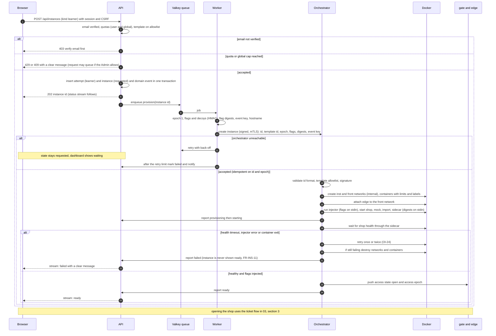

## 2. Candidate: invite, consent, start (FR-ASM-02 to 06, FR-ACC-06, FR-PRV-01, 02, FR-SES-01)

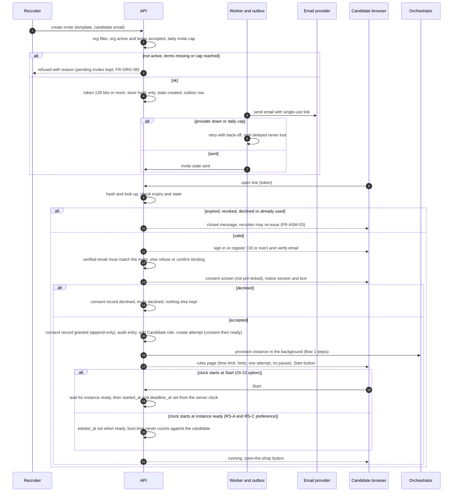

## 3. Candidate: attempt, capture, submit, expiry, freeze, destroy (FR-SES-02 to 11, FR-INS-05)

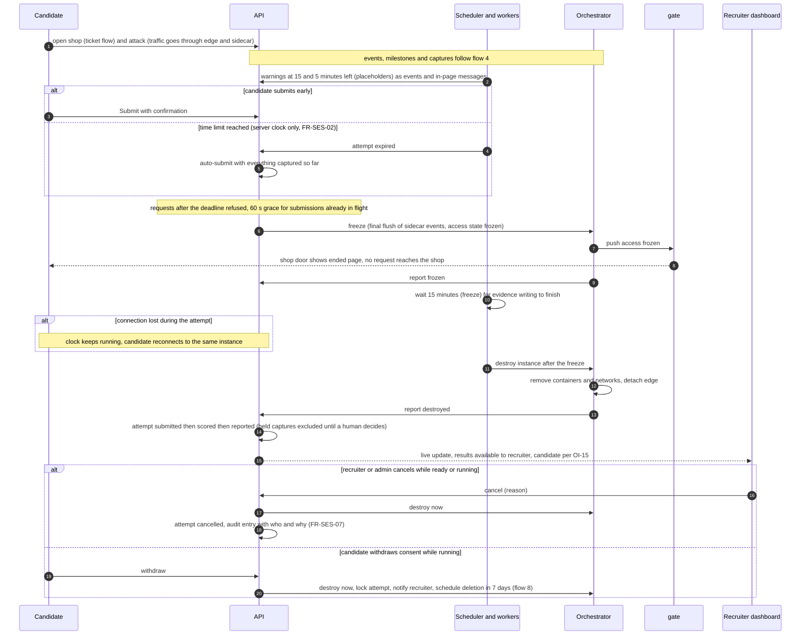

## 4. Event ingestion, scoring, live updates (FR-DET-04, 05, FR-SCR-09, FR-LIV-01 to 06)

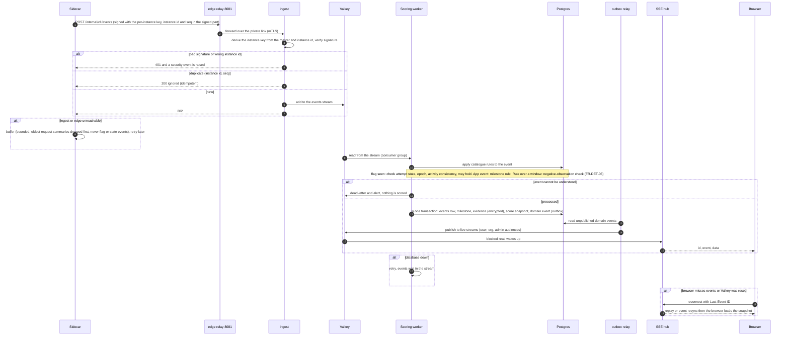

## 5. Flags: derive, inject, capture, paste (D-01, D-02, FR-FLG-01 to 09)

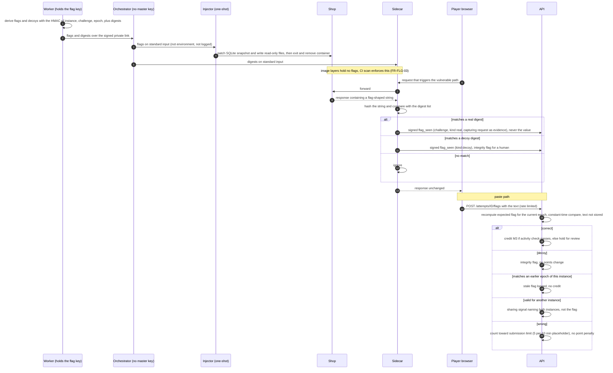

## 6. Recruiter and company approval (FR-ORG-01 to 07, FR-ACC-07, FR-ADM-01)

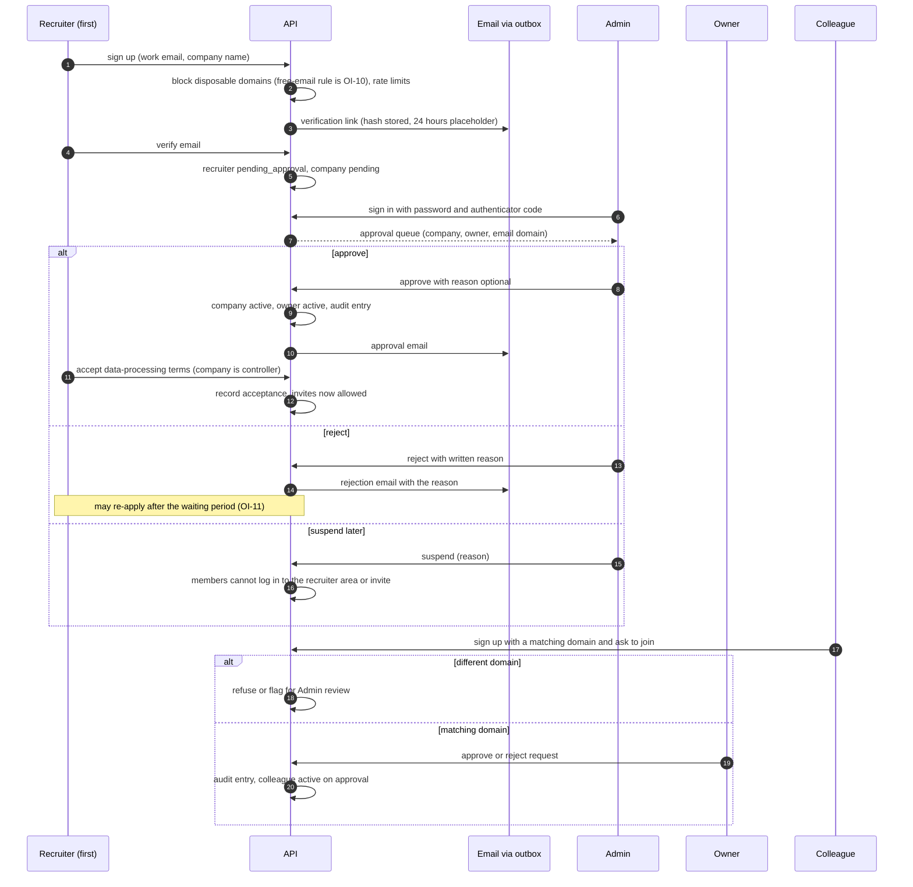

## 7. Break-glass (D-19, FR-ADM-03, FR-ADM-08, FR-ADM-07)

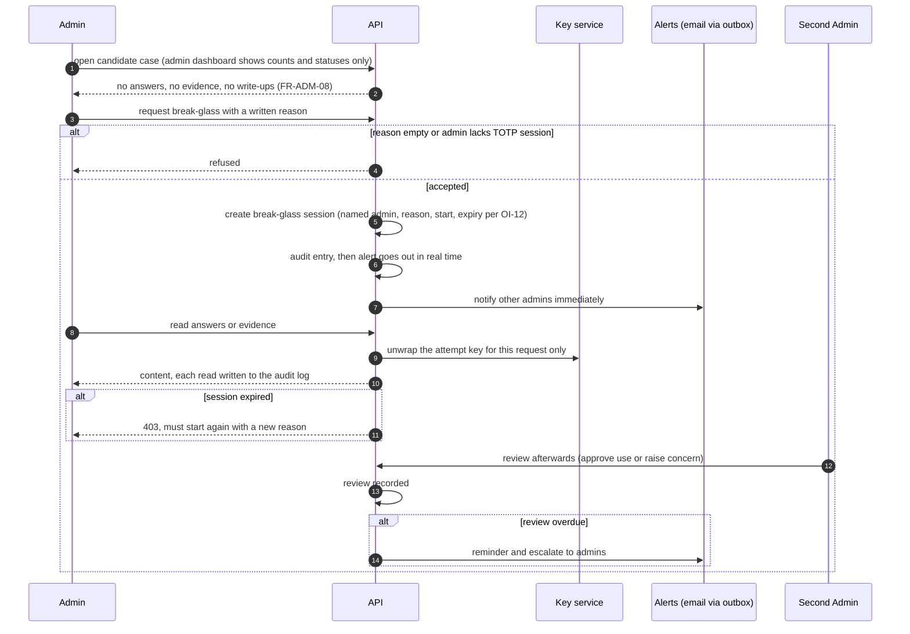

## 8. Retention and deletion (FR-PRV-04 to 09, 18, FR-SES-10, FR-ACC-09)

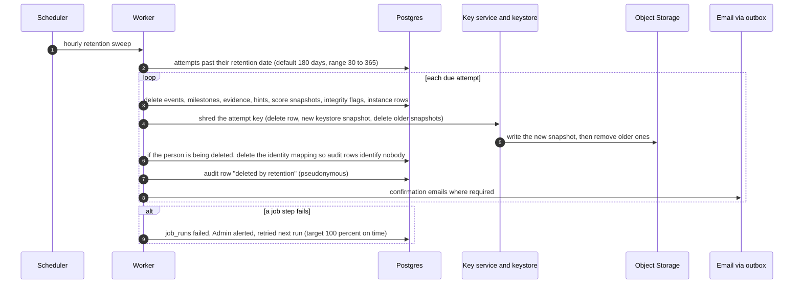

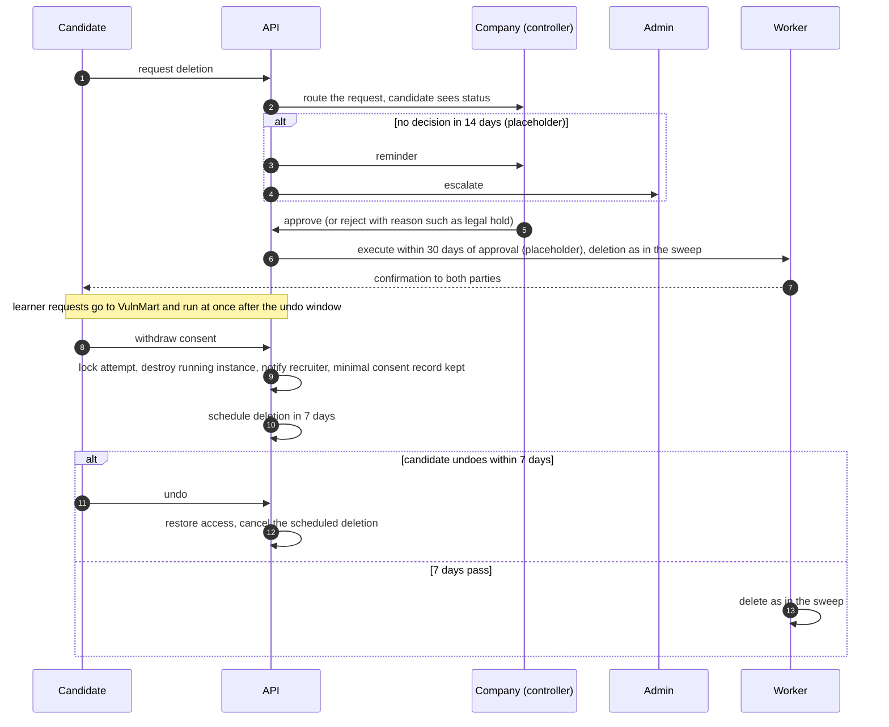

## 9. Reconciler after an orchestrator crash (FR-INS-05, 07, NFR-AVL-04, spike S-13)

Safety rule first: **the orchestrator never destroys anything because a list is empty or missing.** If it cannot fetch the desired state from the API, it keeps what exists and refuses new creations until the list returns.

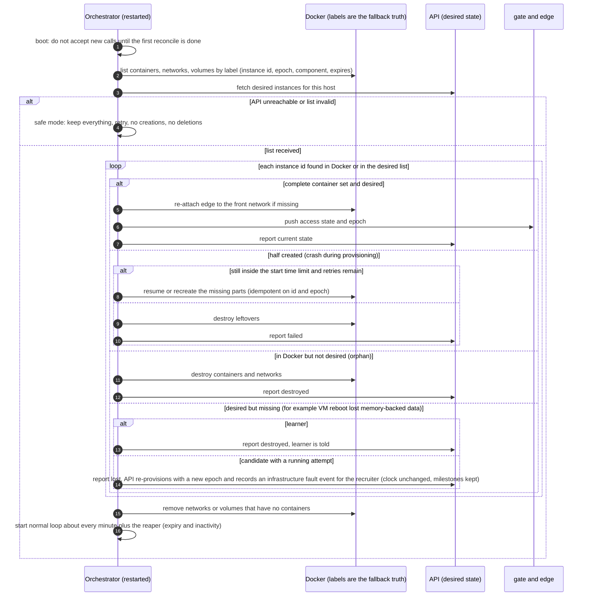

## 10. Reset (FR-INS-04, FR-SES-09, FR-TIM-03, FR-FLG-01)

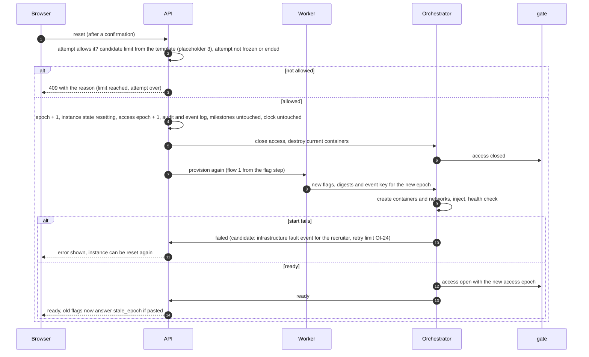
