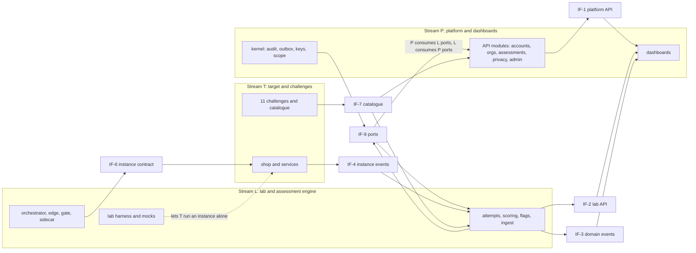

# 07. Repository, contracts and the three work-streams

Status: PROPOSED (2026-10-08). Facts cited `[EF-n]` (register in [README.md](README.md)). Related ADRs: 0012 (monorepo and contract toolchain), 0013 (work-stream split), 0011 (CI builds), 0014 (organization scoping), 0015 (developer engine). The assignment of developers to streams is the user's choice; section 9 only suggests.

Plain terms: a **contract** is a written, versioned agreement about how two parts talk (a file, not a conversation). A **mock** is a fake provider that answers according to the contract so the other side can work alone. A **stub** is a minimal real component with fixed behaviour. **Sprint zero** is the short period before feature coding where only contracts, mocks and tooling are built.

## 1. Monorepo layout

One repository (`owasp-mart`, private, D-14). Python uses a `uv` workspace and JavaScript a `pnpm` workspace (RS-D, UNVERIFIED as tools; ADR 0012).

```
owasp-mart/
  CLAUDE.md  initial.md  CHANGELOG.md          existing rules and source of truth
  .github/
    CODEOWNERS
    workflows/                                  contracts, api, web, lab, shop, images, secrets-and-deps
  contracts/                                    THE shared interfaces (section 3)
    api/platform/*.yaml                         OpenAPI fragments, stream P
    api/lab/*.yaml                              OpenAPI fragments, stream L
    api/bundle/openapi.json                     generated, committed, CI checks it is current
    events/                                     JSON Schemas: instance events, app events, domain events
    orchestrator/orchestrator.openapi.yaml
    instance/                                   instance contract (env, health, labels, injection, events, errors)
    catalog/challenge.schema.json
    errors/error-codes.yaml
    db/table-owners.yaml                        which module owns which table
    mocks/                                      Prism config, fake orchestrator, fake ingest, stub shop
    CHANGELOG.md  COMPAT.md                     contract versions and who targets which
  apps/
    api/                                        FastAPI codebase, five entrypoints: api, ingest, live, worker, scheduler
      src/vulnmart/
        kernel/                                 session and org scope, audit, outbox, key service, settings (P, kept small)
        ports/                                  Python Protocols between P and L (section 3.5)
        accounts/ orgs/ assessments/ privacy/ admin/ notifications/ live/        owned by P
        attempts/ instances/ scoring/ ingest/ flags/                              owned by L
      migrations/                               one Alembic history, files prefixed by owning module
    web/                                        Next.js dashboards (P)
    orchestrator/                               FastAPI and Docker SDK (L)
    shop/                                       Express marketplace, snapshot builder, injector entrypoint (T)
  services/
    sidecar/  gate/  edge/                      Coraza sidecar, gate, custom Caddy build (L)
    mock-services/  import-service/  bot/       payment, KYC, metadata, collector; import service; bot controller (T)
  challenges/
    catalog/*.yaml                              challenge data: tags, flags placement, milestones, hints, write-ups (T)
    tests/c01 ... c11/                          exploit tests: pass on vulnerable, fail on fixed (T)
    fixed/                                      fixed-build patches (T)
  infra/
    compose/                                    dev, laptop, prod-platform, prod-labs, harness
    caddy/  scripts/                            edge configuration, bootstrap, deploy, firewall (L)
  packages/
    ts-client/                                  generated typed client from the bundled OpenAPI
    py-models/                                  generated models from JSON Schemas
  scripts/                                      cross-platform Node scripts (existing check-docs.mjs and new)
  docs/                                         existing documentation system
```

Why one codebase for the API, ingest, live hub, workers and scheduler: one database owner, shared models, shared error handling, separate containers (see [01](01-overview-and-components.md) section 2.1).

## 2. CODEOWNERS

Rules of the format, verified: the last matching pattern wins; owners need explicit write access; **approval from any one listed owner satisfies a code-owner requirement** (several owners on a line do not mean all must approve); enforcement works through branch protection "Require review from Code Owners" `[EF-30]`. Whether branch protection and required reviews are available on a **private repository owned by a personal GitHub Free account** was not stated on the pages read, so it is UNVERIFIED and the user must check the repository settings. If it is not available, CODEOWNERS only requests reviews and the CI check `contract-approvals` (section 5) becomes the enforcement, with a pull-request checklist.

Illustrative file (handles are placeholders for the three developers; paths follow section 1):

```
# default: nobody owns it implicitly, so every path below must be listed
*                                   @dev-P @dev-L @dev-T

/contracts/api/platform/            @dev-P
/contracts/api/lab/                 @dev-L
/contracts/events/                  @dev-L
/contracts/orchestrator/            @dev-L
/contracts/instance/                @dev-L @dev-T
/contracts/catalog/                 @dev-T
/contracts/errors/                  @dev-P
/contracts/db/                      @dev-P
/contracts/mocks/                   @dev-L
/apps/api/src/vulnmart/kernel/      @dev-P
/apps/api/src/vulnmart/ports/       @dev-P @dev-L
/apps/api/src/vulnmart/accounts/    @dev-P
/apps/api/src/vulnmart/orgs/        @dev-P
/apps/api/src/vulnmart/assessments/ @dev-P
/apps/api/src/vulnmart/privacy/     @dev-P
/apps/api/src/vulnmart/admin/       @dev-P
/apps/api/src/vulnmart/notifications/ @dev-P
/apps/api/src/vulnmart/live/        @dev-P
/apps/api/src/vulnmart/attempts/    @dev-L
/apps/api/src/vulnmart/instances/   @dev-L
/apps/api/src/vulnmart/scoring/     @dev-L
/apps/api/src/vulnmart/ingest/      @dev-L
/apps/api/src/vulnmart/flags/       @dev-L
/apps/api/migrations/               @dev-P @dev-L
/apps/web/                          @dev-P
/apps/orchestrator/                 @dev-L
/apps/shop/                         @dev-T
/services/sidecar/ /services/gate/ /services/edge/    @dev-L
/services/mock-services/ /services/import-service/ /services/bot/   @dev-T
/challenges/                        @dev-T
/infra/                             @dev-L
/.github/                           @dev-L @dev-P @dev-T
/docs/                              @dev-P @dev-L @dev-T
```

## 3. Contract-first rules

General rules: (1) a contract file exists, is reviewed and merged **before** either side codes against it; (2) every contract has one owner who can merge changes; (3) every contract ships with a mock or stub and a conformance check; (4) contracts carry a semantic version and a changelog entry (`contracts/CHANGELOG.md`); (5) no stream reads another stream's database tables or private modules.

### 3.1 Contract catalogue

| ID | Contract | File | Owner | Consumers | Format | Mock or stub |
|---|---|---|---|---|---|---|
| IF-1 | Browser-facing platform API (P part) | `contracts/api/platform/*.yaml` | P | Dashboards (P), tests | OpenAPI | Prism mock |
| IF-2 | Browser-facing lab API (instances, attempts runtime, flag submit, hints, reports) | `contracts/api/lab/*.yaml` | L | Dashboards (P) | OpenAPI | Prism mock |
| IF-3 | Domain events (what the live stream carries) | `contracts/events/domain-events.schema.json` | P (L adds types by PR) | Dashboards, SSE hub, L publishers | JSON Schema | Event fixtures and a replay script |
| IF-4 | Instance events (sidecar and app events to ingest) | `contracts/events/instance-events.schema.json` | L | T (app events), ingest | JSON Schema | Fake ingest that validates and prints |
| IF-5 | Orchestrator API (platform to orchestrator, orchestrator to platform) | `contracts/orchestrator/orchestrator.openapi.yaml` | L | Workers (L) | OpenAPI | Fake orchestrator |
| IF-6 | Instance contract (what an instance must look like) | `contracts/instance/*` | L with T | Orchestrator (L), shop and services (T) | Markdown plus JSON Schema for the spec | Stub shop and the lab harness |
| IF-7 | Challenge catalogue schema and data | `contracts/catalog/challenge.schema.json`, data in `challenges/catalog` | T | P (dashboards, API), L (scoring, injector) | JSON Schema, YAML data | Eleven stub entries committed in sprint zero |
| IF-8 | Error codes and error format | `contracts/errors/error-codes.yaml` | P (anyone adds by PR) | All | YAML | Generated constants |
| IF-9 | Internal service interfaces between P and L | `apps/api/src/vulnmart/ports/*.py` | The provider of each port | The other stream | Python Protocols with docstrings | In-memory fakes |
| IF-10 | Database table ownership | `contracts/db/table-owners.yaml` | P | All migrations | YAML | CI check |

### 3.2 Instance contract (IF-6), contents

This is the document the shop and every in-instance service obey, and the orchestrator relies on. It lives in `contracts/instance/` and covers:

1. **Containers and roles.** shop, sidecar, mock-services, import-service, bot controller, injector (one-shot). Ports: sidecar 8080 (player traffic from the edge) and 9000 (app events from the shop, instance network only); shop 3000; mock-services fixed ports for payment, KYC, metadata, collector; bot controller one internal port.
2. **Environment variables (non-secret only).** Examples: `VM_INSTANCE_ID`, `VM_EPOCH`, `VM_PUBLIC_HOST`, `VM_SIDECAR_EVENTS_URL`, `VM_MOCK_URL`, `VM_IMPORT_SOCKET`, `VM_DB_PATH`, `VM_CATALOG_DB_PATH`, `VM_SNAPSHOT_PATH`, `VM_FLAGS_PATH`, `PORT`, `TZ=UTC`, `VM_LOG_LEVEL`. **No key and no flag in the environment**, except a flag for a challenge whose catalogue entry says `flag_delivery: env` with a written reason (FR-FLG-03).
3. **Health.** `GET /healthz` (process up), `GET /readyz` (200 only after the injector marker exists and the database is open), `GET /version` (build id and catalogue version, no secrets). The orchestrator reads Docker's built-in health status of the container, which runs the check inside it. These paths are not routed to players. `/_vm/` is a reserved path prefix on the public host and `/_ops/diagnostics` belongs to challenge C05; the shop must not use `/_vm/`.
4. **Labels** on every container and network: `vm.schema`, `vm.instance`, `vm.epoch`, `vm.component`, `vm.template`, `vm.expires`, `vm.host`, `vm.kind` (`inst` or `front`), and `vm.owner` as an opaque hash, never an email (FR-INS-05).
5. **Flag injection.** The injector is the shop image's `inject` entrypoint, run as a one-shot container. The orchestrator writes one JSON document on its standard input (schema version, epoch, flags, decoys, seeds). The injector patches the snapshot and writes read-only files named in the catalogue (`flag_placement`), writes `/run/vm/flags.json` (mode 0400) for sentinel logic and the marker file `/run/vm/injected`, then exits. Exit codes map to error codes (section 3.6). The container is removed at once.
6. **Event emission.** The shop posts JSON to the sidecar's event endpoint on the instance network. Body fields: `name`, `ts`, optional `challenge_key`, `actor_role`, small `data` (no secrets, size capped). Names are a catalogue in `contracts/events/app-events.md` (for example cross-store order read, gift card redeemed, refund total above paid, diagnostics viewed, unsigned webhook accepted, KYC fail-open approval, metadata fetched, bot visit, XSS token received; the exact milestone mapping is OI-17). The sidecar adds `instance_id`, `seq`, `source: app`, signs and forwards.
7. **Runtime profile.** Non-root user, read-only root filesystem, writable memory-backed `/tmp`, `/data` and `/run/vm`, all capabilities dropped, no egress, no host mounts, memory and CPU limits declared in the template (FR-SHP-15, NFR-ISO-03).
8. **Import service.** Proposal for T to confirm: its container has no network at all and talks to the shop through a unix socket on a shared memory-backed volume, with a fresh process per job. This is how "no network, no database access" (FR-CHL-07, FR-INS-02) can hold while the shop still sends jobs.
9. **Bot controller.** A small always-present container; the Chromium process is launched per visit with a fresh context, a fixed lifetime and only the shop origin, then closed (FR-SHP-11). Always-on count therefore includes the controller.
10. **Database ownership.** The shop's SQLite files belong to T. The shop never contacts the platform database, Valkey, the orchestrator or other instances (FR-SHP-14).
11. **Catalogue fields** that the instance depends on: `flag_placement`, `flag_delivery`, `start_state` (seeded login for the player), milestone definitions (event names or sidecar rule IDs), exploit test path, fixed-build reference.

### 3.3 Orchestrator interface (IF-5)

Python `InstanceHost` protocol (platform side, in `ports/`) and the HTTP API behind it:

| Call | Meaning |
|---|---|
| `POST /v1/instances` | Create from `{instance_id, template_id, epoch, flags, decoys, flag_digests, event_key, hostname, limits}`; idempotent on `(instance_id, epoch)` |
| `GET /v1/instances/{id}` | Current state, health, error code |
| `POST /v1/instances/{id}/reset` | Destroy and recreate with a new epoch |
| `POST /v1/instances/{id}/access` | Set `open`, `frozen` or `closed` and the access epoch |
| `POST /v1/instances/{id}/destroy` | Remove everything |
| `GET /v1/instances` | List by label for the reconciler and the Admin view |
| `GET /v1/host` | Capacity and health for the capacity view |
| `POST /internal/v1/orch/state` (orchestrator to API) | State transition reports (signed) |

Implementations: the real HTTP client, an in-memory `FakeInstanceHost`, and the fake orchestrator service for Compose. The orchestrator accepts instance IDs and template names only (NFR-SEC-04).

### 3.4 OpenAPI composition and generated artefacts

The browser API is authored as OpenAPI fragments per stream, bundled into `contracts/api/bundle/openapi.json` by a script, and FastAPI route definitions must match it (CI exports the running app's schema and compares). The typed TypeScript client and Pydantic models are generated from the bundle and the JSON Schemas and are committed, so nobody waits for a build step to have types. Tools named for this (Prism, oasdiff, Schemathesis, openapi-ts or Orval) come from RS-D and are UNVERIFIED (not read in a primary source); ADR 0012 asks the user to confirm them.

### 3.5 Internal ports between P and L (IF-9)

The two streams share one deployable codebase, so their agreement is a set of Python Protocols with fakes.

| Provided by | Port | Used by | Purpose |
|---|---|---|---|
| L | `AttemptPort` (create from consent, state, cancel, withdraw, purge) | P | Hand over a consented attempt, drive withdrawal and deletion |
| L | `ReportPort` (score, per-challenge, evidence read, integrity flags) | P | Recruiter and candidate views, exports |
| L | `InstancePort` (request, open ticket, reset, stop, force-stop, capacity) | P | Learner and admin screens |
| P | `AuditPort` (append) | L | Audit writes from instance and scoring actions |
| P | `OutboxPort` (publish domain event, enqueue email) | L | Live updates and notifications |
| P | `KeyPort` (create, wrap, unwrap, shred) | L | Evidence encryption |
| P | `ScopePort` (current user and organization scope) | L | Filtering and row-level security |
| P | `SettingsPort` and `QuotaPort` | L | Timeouts, caps, quotas |
| T | none | | T has no code-level port; T meets L at IF-4, IF-6, IF-7 only |

### 3.6 Errors

One registry (`contracts/errors/error-codes.yaml`) with stable codes and a problem-details style JSON body (`code`, `message`, `request_id`; never a stack trace, NFR-SEC-03). Families: `AUTH-*`, `ORG-*`, `ASM-*`, `ATT-*`, `INST-*` (for example health timeout, injection failed, image missing, quota), `ORCH-*` (template unknown, busy, bad signature), `EVT-*` (bad signature, duplicate, schema, too large), `PRV-*`. Injector and container exit codes map to `INST-*` codes in the same file. Adding a code is an additive change; renaming or removing one is breaking.

## 4. Mock servers and stubs: how each stream runs alone

| Provided by | Mock or stub | Lets this stream work alone |
|---|---|---|
| P (via Prism and fixtures) | **Platform mock**: serves IF-1 and IF-2 examples | The dashboards can be built without a backend; L can test its own pages |
| L | **Fake orchestrator** (IF-5), **fake ingest** (prints and validates IF-4), **stub shop** (a tiny Node app that satisfies IF-6: health, serves a planted flag, emits one app event), **lab harness** (Compose file that starts one full instance with the real sidecar, edge and gate and the stub shop) | T runs and tests the real shop inside a real instance from day one; P tests provisioning flows without Docker |
| L | **Fakes of P's ports** (in-memory audit, outbox, key, scope) | L builds and tests scoring and the orchestrator without P's modules |
| P | **Fakes of L's ports** | P builds the privacy, assessment and admin modules without a running lab |
| T | **Catalogue stubs** (eleven entries with placeholder milestones) | P and L can render and score challenges before the real content exists |
| T | **Exploit test runner** that talks to any instance URL | L's CI can check that the harness is wired correctly |

## 5. CI path filters and contract checks

Path filters decide what runs (workflow table in [02](02-deployment-and-network.md) section 6). Checks that protect the contracts:

| Check | Trigger | What fails the build |
|---|---|---|
| Schema validity | `contracts/**` | An invalid OpenAPI or JSON Schema, or an example that does not match its schema |
| Breaking-change check | `contracts/api/**`, `contracts/orchestrator/**`, `contracts/events/**` | Removing or retyping a field, route or event type without a major version bump |
| Bundle and generated code current | `contracts/**` | `openapi.json`, the TypeScript client or the Python models do not match the sources |
| Mock validity | `contracts/mocks/**` | A mock response that violates the contract |
| Provider conformance | `apps/api/**`, `apps/orchestrator/**`, `services/sidecar/**` | The running component violates its contract (Schemathesis-style test, event schema validation on emitted events) |
| Consumer test against the mock | `apps/web/**`, `apps/shop/**`, `apps/orchestrator/**` | The consumer breaks when run against the mock |
| `alembic heads` single head, apply from empty and from the previous release | `apps/api/migrations/**` | More than one head or an upgrade failure |
| Table ownership | `apps/api/migrations/**` | A migration touches a table owned by another module without that owner's approval (`contracts/db/table-owners.yaml`) |
| Contract approvals | Pull requests changing `contracts/**` | Missing approval from the contract owner or from a required consumer (script reads review state; enforcement for a private personal repository is UNVERIFIED, see section 2) |
| Compatibility file | All | `contracts/COMPAT.md` lists a contract version that no longer exists |
| Docs gate | Existing | Code without dev-log and changelog (D-14) |

## 6. Full-stack local development with Docker Compose (Windows and macOS)

- One Compose project with profiles: `platform` (Postgres, Valkey, Mailpit, API, ingest, live, worker, scheduler, Caddy), `web` (Next.js dev server), `lab` (orchestrator, socket proxy, edge, gate, instance images), `mocks` (Prism, fake orchestrator, fake ingest, stub shop). A Node script (`scripts/dev.mjs`) starts the right profiles per stream, so there is one command on every OS (NFR-POR-03).
- Stream recipes: P runs `platform + web + mocks(fake orchestrator)`; L runs `platform(minimal) + lab + mocks(stub shop, fake ingest)`; T runs `lab + the shop` with the platform replaced by the fake ingest.
- Hostnames are `*.localhost` over plain HTTP on loopback (confirm Chrome, Firefox and Safari behaviour in spike S-20).
- Windows: Docker Desktop on WSL2; line endings are pinned to LF (existing repository rule); keep `node_modules` and database data in named volumes, not Windows bind mounts, because bind mounts across the Windows and Linux file systems are slow (general experience, UNVERIFIED). macOS Intel: Docker Desktop for Intel is supported on the current and two previous macOS versions `[EF-26]`.
- **Cannot be tested on Docker Desktop (Windows or macOS):** the host-side INPUT drop rule (the engine runs in a VM the user cannot configure), user-namespace, rootless and gVisor behaviour, native arm64 behaviour (only emulated), real Let's Encrypt and DNS challenges, the Vercel rewrite and its SSE behaviour (needs a preview deployment), Oracle security lists, the private link between two VMs (simulated with two networks), and idle reclaim. These are proven on the Linux CI runners and on the Oracle VMs (spikes S-3, S-8, S-14, S-17). The `--internal` network behaviour, the reconciler, the edge attachment pattern and the instance contract **can** be tested locally.
- Developers should expect Tanmay's PC to need WSL and Docker data moved to D: before anything runs (K-10).

## 7. The three work-streams

### 7.1 Alternatives considered

Counts are PRD requirement IDs (FR-xxx-nn) assigned by primary ownership; they total 170. Effort per ID differs a lot, so counts are only one view of balance.

| Split | Streams | Independence | Load balance | Deadlock risk | Verdict |
|---|---|---|---|---|---|
| **A. By layer** | Frontend (4 dashboards, SSE client) · Backend (API, workers, scoring, privacy, orchestrator-facing logic) · Lab (orchestrator, instances, sidecar, shop, challenges) | Frontend depends on almost every backend endpoint, so the OpenAPI contract is the busiest interface and changes constantly | Frontend about 12 IDs plus the UI of many others; Backend about 97; Lab about 61 | **High** at the frontend and backend boundary (every feature needs both sides); Lab is separate | Rejected: the busiest interface sits between two people building the same features |
| **B. By vertical slice** | Learn (accounts, instances, flags, shop, challenges) · Hire (organizations, assessments, sessions, scoring) · Admin, privacy and ops | Each slice needs instances, accounts, scoring and audit that live in another slice; there is no natural owner for shared parts | Learn about 75; Hire about 63; Admin about 32 | **High**: shared kernel conflicts, double work on scoring and instances, migrations collide | Rejected |
| **C. By component (trust zone)** | Control plane (API, dashboards, scoring, privacy, admin) · Instance plane (orchestrator, edge, sidecar) · Target (shop, challenges) | Excellent: contracts coincide with trust and deployment boundaries | **Poor**: control plane about 109 IDs, instance plane about 29, target about 32 | Low | Close, but overloads one person |
| **D. By contract boundary (recommended)** | **P** Platform and dashboards (people and data) · **L** Lab (instance lifecycle, attempt runtime, flags, events, scoring, deployment) · **T** Target and challenges (shop, services, 11 challenges) | Three small, stable contracts (IF-2/IF-4/IF-6/IF-7 and the P-L ports); P and T have **no** direct interface; L is the hub | P about 76 IDs, L about 62, T about 32 (but the heaviest per ID: eleven exploits with fixed builds and tests, about 20 tables, 7 state machines, six roles) | **Medium-low**: L is a hub, mitigated by sprint-zero stubs and the rules in 7.5 | **Recommended** |

D differs from C by moving the scoring, attempt clock, flags and anti-cheat (the "assessment engine") from the control plane to the lab, because they are driven by instance events and share the instance lifecycle; this leaves P with the people-and-data half, which is large but made of familiar patterns.

### 7.2 Stream P: Platform and dashboards

- **Components:** K-01 dashboards, K-02 platform edge, K-03 API (P modules), K-05 scheduler, K-07 SSE hub, K-08/K-09 data configuration, K-10 email, K-11 audit, K-12 key service; Vercel deployment.
- **Functional IDs (76):** FR-ACC-01..11, FR-ORG-01..08, FR-ASM-01..06, FR-HNT-01..03 (UI and content wiring), FR-DSH-01..06, FR-LIV-01..06, FR-EXP-01..04, FR-PRV-01..20, FR-ADM-01..08, FR-NTF-01..04.
- **Non-functional:** NFR-SEC-01, 03, 05 (platform side), 08 (platform side), NFR-PRI-01..02, NFR-UX-01..04, NFR-EXT-01, NFR-MNT-05, NFR-CST-02, NFR-OBS-01..02 (platform side), NFR-AVL-05 (backups).
- **Owns tables:** identity, organizations, assessments, consent, privacy, admin, audit, outbox, settings, job runs ([04](04-data-and-state.md)).
- **Provides:** IF-1, IF-3, IF-8, IF-10, ports `AuditPort`, `OutboxPort`, `KeyPort`, `ScopePort`, `SettingsPort`, `QuotaPort`.
- **Consumes:** IF-2, IF-7; ports `AttemptPort`, `ReportPort`, `InstancePort`.

### 7.3 Stream L: Lab (instance plane and assessment engine)

- **Components:** K-04 workers (provision, scoring jobs), K-06 ingest, K-13 orchestrator, K-14 labs edge and gate, K-20 sidecar, deployment of both VMs, the lab harness, image CI.
- **Functional IDs (62):** FR-SES-01..11, FR-INS-01..11, FR-FLG-01..09, FR-DET-01..09, FR-SCR-01..10, FR-TIM-01..05, FR-ACH-01..07.
- **Non-functional:** NFR-SEC-02 (orchestrator), 04, 06, NFR-ISO-01..07, NFR-PRF-01..03, NFR-AVL-01..04, NFR-POR-01..03, NFR-EXT-02, 04, NFR-MNT-04 (CI), NFR-CST-01, NFR-OBS-02 (orchestrator).
- **Owns tables:** attempts, instances and history, events, milestones, flag submissions, hints, evidence, integrity flags, scores, activity.
- **Provides:** IF-2, IF-4, IF-5, IF-6, ports `AttemptPort`, `ReportPort`, `InstancePort`, the mocks and the lab harness.
- **Consumes:** IF-3 (to publish), IF-7; ports of P.
- **Heaviest unknowns:** spikes S-1 to S-4, S-6 to S-8, S-11, S-13 to S-17, S-22.

### 7.4 Stream T: Target app and challenges

- **Components:** K-15 to K-19 and K-21 to K-22: shop, SQLite snapshot builder, catalog store, import service, mock-services with the XSS collector, bot controller, flag injector entrypoint; the 11 challenges, exploit tests, fixed builds, hints and write-ups, seed data.
- **Functional IDs (32):** FR-CHL-01..17, FR-SHP-01..15 (and FR-INS-02 for the container content, FR-FLG-03 injection side, FR-HNT-01 content, FR-CHL-14 write-ups).
- **Non-functional:** NFR-EXT-03, NFR-ISO-03 (image runtime profile), NFR-ISO-07 (no egress by construction), NFR-SEC-07 (allow-list for C06's intentional library).
- **Owns:** `apps/shop`, `services/mock-services`, `services/import-service`, `services/bot`, `challenges/`.
- **Provides:** IF-7 (and the app-event names in IF-6).
- **Consumes:** IF-4 (app event format), IF-6, the lab harness.
- **Decisions waiting on the user that block T:** OI-17 (milestones), OI-18 (XSS card), OI-19 (refund model), OI-20 (pending-seller drafts), OI-16 (tiers).
- **Balance lever:** the sidecar (K-20, Go, Coraza and CRS) and spikes S-6, S-7, S-9 depend on challenge knowledge and may move from L to T if L is overloaded.

### 7.5 Interfaces between streams

| Interface | Between | Contract file | Owner | Mock |
|---|---|---|---|---|
| IF-1 platform API | P (server) to dashboards (P) | `contracts/api/platform/` | P | Prism |
| IF-2 lab API | L to dashboards (P) | `contracts/api/lab/` | L | Prism |
| IF-3 domain events | L and P publishers to dashboards via SSE | `contracts/events/domain-events.schema.json` | P | Fixtures |
| IF-4 instance events | T app events and L sidecar to L ingest | `contracts/events/instance-events.schema.json` | L | Fake ingest |
| IF-6 instance contract | L to T | `contracts/instance/` | L with T | Stub shop and harness |
| IF-7 catalogue | T to P and L | `contracts/catalog/` | T | Stub entries |
| IF-9 ports | P and L | `apps/api/src/vulnmart/ports/` | Provider | Fakes |
| IF-8 errors, IF-10 table ownership | All | `contracts/errors/`, `contracts/db/` | P | Generated |

### 7.6 Dependency graph



Reading it: P and T never depend on each other directly; both depend on L's contracts and on L's stubs, which is why those stubs come first. L depends on P's ports and on T's catalogue, both replaced by fakes and stubs until real.

### 7.7 Sprint zero: contract deliverables in order

All of this is done before feature coding. Each item is done when the contract file is merged, its mock or stub runs, and the conformance check is in CI.

| # | Deliverable | Owner | Needed before |
|---|---|---|---|
| 0 | Repository skeleton, tool pins (from the registries on the day), workspaces, CI skeleton, CODEOWNERS, Compose profiles, `scripts/dev.mjs` | L (with all) | everything |
| 1 | Error registry and problem format (IF-8) | P | 2 to 6 |
| 2 | Challenge catalogue schema and 11 stub entries (IF-7) | T | 3, 5, 6 |
| 3 | Instance contract v0: containers, env, health, labels, injection protocol, runtime profile (IF-6) | L with T | 4, 9 |
| 4 | Instance event schema and app-event name list (IF-4) | L, T reviews | 8, 9 |
| 5 | Domain event schema (IF-3) | P, L reviews | 6, 7 |
| 6 | Platform and lab API fragments with examples, bundle, Prism mock, generated client (IF-1, IF-2) | P and L | web work |
| 7 | Ports as Protocols with in-memory fakes (IF-9) and `table-owners.yaml` (IF-10) | P and L | module work |
| 8 | Orchestrator API and the fake orchestrator (IF-5) | L | worker work |
| 9 | Stub shop, fake ingest and the lab harness (one full instance on a laptop) | L | T's shop work |
| 10 | Contract checks live in CI (section 5) | L with P | feature work |
| 11 | Tag `contracts-v1.0.0`; start the change rules below | all | feature coding |

### 7.8 Rules that prevent deadlock

1. **One owner per contract**, listed in CODEOWNERS and `contracts/COMPAT.md`; only the owner merges.
2. **Additive changes** (new optional field, new endpoint, new event type, new error code) can be merged by the owner with one consumer's approval, or after one working day of silence with the consumer notified in the pull request. Minor version bump.
3. **Breaking changes** need approval from every consumer and an expand-then-contract path: add the new form, keep the old for one release, remove later. Major version bump and a changelog entry.
4. **Mocks move with contracts**: a contract pull request that does not update its mock or stub fails CI.
5. **Never wait on another stream's code**: build against mocks, fakes and stubs. When blocked more than one working day, open a contract request, add the missing piece to the mock behind a clearly marked pending flag, and continue; the owner implements the real thing later.
6. **Definition of done for any interface**: contract file, mock or stub, provider conformance test, consumer test against the mock.
7. **No cross-stream edits** to another stream's paths except by pull request that the owner approves. The shared kernel (`kernel/`) is owned by P, may receive additions from L by pull request, and is kept deliberately small.
8. **Migrations**: one Alembic history, one migration per pull request, the owner of every touched table approves, backward-compatible for one release, and the later pull request rebases when two migrations collide.
9. **Version pinning**: each stream records the contract version it builds against; CI fails if the version no longer exists. Contract tags are `contracts-vX.Y.Z`.
10. **Response time**: contract pull requests get a first response within one working day (placeholder, to be agreed by the team). L, as hub, prioritises contract and stub requests above feature work.
11. **Open product questions that block contracts** (OI-16 to OI-20) are raised with the user in one batch at the start, not discovered later.

## 8. Assignment suggestion (the user decides)

Constraints: Tanmay (Windows 11 Home, demo machine, probably repository and possibly Oracle owner, Docker not yet set up), Akshay (Intel Mac), Sahil (Windows 11, edition unknown).

- **L needs Linux-minded work** (network rules, Docker internals, the Oracle VMs, deployment) and the stream that touches the demo laptop and VM access. Suggestion: **Tanmay to L**, after the one-time WSL and Docker setup. This also keeps the demo-laptop fallback with the person who controls it.
- **P is the largest by requirement count but is mostly web and Python patterns with no OS-specific work.** Suggestion: **Akshay to P** (macOS is a good fit for Next.js and the Vercel work).
- **T is Node and security-content work that runs entirely in containers and can be done on any OS.** Suggestion: **Sahil to T**, with the option to take the sidecar and spikes S-6, S-7, S-9 if L is overloaded.

Workload note: P has the most IDs, L has the hardest unknowns, T has the fewest IDs and the most per-ID effort. If the user prefers different pairings, nothing in the contracts depends on the person.
